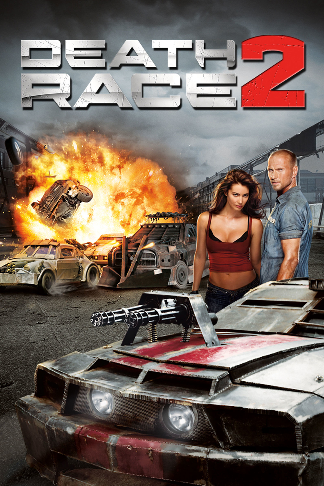

# Learn C++

> **This repo is actively being updated as I learn C++.**

I’m taking my time with it, so there may be periods without any commits. I’ll push new updates whenever I learn something new or have something interesting to share. No rush, just pure effort and enjoying the journey.

To be specific, I will use **C++23** for this course.

**It’s late 2026, and I’m still giving C++ a try instead of Rust or any other programming language.**

- No AI assistants
- 100% pure effort
- No rush, just chilling

**Why do I want to learn C++?**

I have a childish dream of building an RC car racing track connected to a real-time website that can instantly update the cars’ stats, display a real-time leaderboard, and provide livestreaming with a commentator.

So, I think it’s not too late to make this dream come true.

**Why anti-AI?**

I’m not in a rush. I have time for myself to learn C++ deeply, and I want to build real muscle memory.

I believe I’ll live for a very long time, so spending a few months learning C++ costs me nothing.

I’m happy with this trade.

## Table of contents

- [Variable and data types](1_variable_and_data_types.md)
