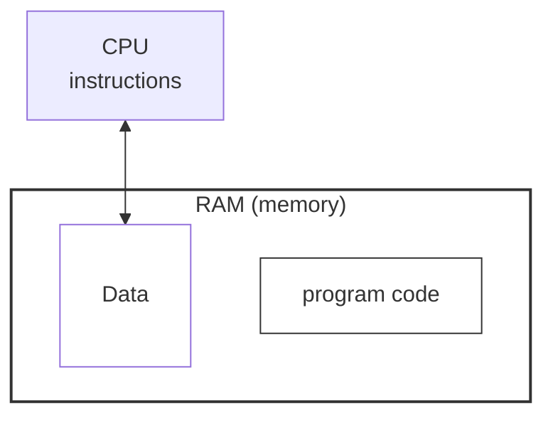

# 1.1 Introduction to Data Structures & Algorithms

[TOC]

## **What are data structures?**

A program is a set of instructions that performs operations on data, so without data, instructions cannot be performed => data is an important part of a program.

When a program deals with data, the way it organizes that data in memory is called a data structure.

Or you could say it this way: the way you organize data in the main memory during the execution of a program -> that is a data structure.

Depending on the requirements of a program and the type of procedures it performs, we have various data structures.

Depending on your requirements, you can choose a **suitable** data structure.

## **What are the types of data structures?**

### **Physical data structures:** 

They define how the data is **arranged** in memory.

- Arrays
- Matrices
- Linked Lists

### **Logical data structures:** 

They define how the data can be **utilized**.

- Stacks
- Queues
- Trees
- Graphs
- Hashing

## Why should we study data structures?

1. Data structures are a core subject for programmers and IT professionals. You have to learn them for interviews and to graduate in Computer Science.
2. If you work in the IT industry, you have to use data structures in application development; without data structures, you cannot develop applications at all.

## To what level should you study data structures?

1. Level 1 - The basics: you know what these data structures are and how they work.
2. Level 2: you know how they work in detail, and you are able to analyze them. You understand in depth what operations can be performed on them and how those operations are performed. **You know the internal details and are able to analyze them based on their time and space complexities.**
3. Level 3: you know everything in detail, and you also know how to code them, so you can develop your own data structures. That means you can program them by yourself. At this level, you need programming practice.

## To what level does this course cover these data structures?

Level 3, in short. You will know these data structures and how they work in detail, be able to do both basic and in-depth analysis, and be able to write your own programs that implement these data structures from scratch.

## Do I need to develop these data structures by myself in every programming language?

No. Most programming languages already have built-in data structures; you just need to use them. In C++ it is the STL, in Java and C# it is collections, etc.
