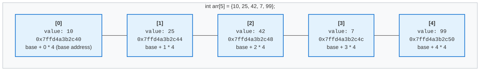
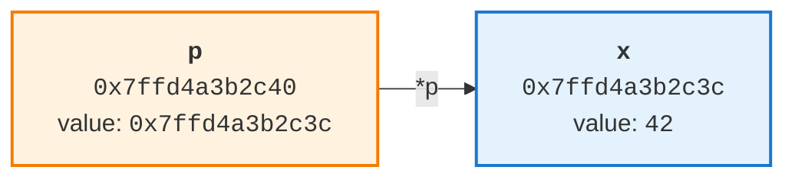

# 2.1 Arrays, Structures & Pointers in C++

> **Why this chapter is all about memory.** In
> [1.1 - Introduction to Data Structures & Algorithms](1.1%20introduction_to_data_structures_algorithm.md)
> we split data structures into two kinds:
>
> - **Physical**:  **Arrays**, **Matrices**, **Linked Lists**. They define how data is *arranged*
>   in memory.
> - **Logical**: Stacks, Queues, Trees, Graphs, Hashing. They define how data is *utilized*.
>
> **This chapter is the physical half, and "physical" is meant literally.** An array *is* a rule
> about addresses `base + i * size`, nothing more. A linked list *is* a rule about which node
> holds the address of the next one. Strip the memory arrangement away and there is no data
> structure left. That is why the pages ahead are full of addresses, bytes, alignment and the
> process address space instead of operations like `push` and `pop`: **for a physical data
> structure, the memory arrangement is the data structure.**
>
> (**Matrices** are the third one on the list, and they need no separate chapter - a matrix is an
> array with more than one index, laid out in the same contiguous block, reached with
> `base + (i * columns + j) * size`.)
>
> The second reason to care: **every logical data structure is built on top of a physical one.**
>
> | Logical structure | Physically, it is… |
> |---|---|
> | Stack, Queue | an array, or a linked list |
> | Tree | linked nodes, or an array (a binary heap) |
> | Graph | an adjacency **matrix** (array), or an adjacency **list** (linked list) |
> | Hashing | an array of buckets, plus linked lists for collisions |
>
> So the two structures in this chapter are the raw material for the entire rest of the course.
> Arrays are section 1; the pointer machinery that makes a linked list possible is section 3.

## 1. Arrays - the first physical data structure

An array is a collection of elements of the **same type**, stored in one **contiguous** block of memory.
That contiguous block is not an implementation detail - it *is* the array. This is what makes it a
**physical** data structure.

If you have a set of integers, floats, doubles or longs, you can group them under a single name as an array.


**Define an array**

```c++
// example 1
// define an array variable, and initialize value immedately
int arr[5] = {10, 25, 42, 7, 99};

// example 2
// define an array
long day_in_week[7];
// 2.2 assign value to each array element
day_in_week[0] = 2;
day_in_week[1] = 3;
day_in_week[2] = 4;
day_in_week[3] = 5;
day_in_week[4] = 6;
day_in_week[5] = 7;
day_in_week[6] = 8;
```

Key properties of a built-in (C-style) array:

- All elements have the same type, so every element has the same size (`sizeof(int)` here).
- Elements are laid out back-to-back in memory, which is why the address of element `i` is
  `base_address + i * sizeof(element)`. This is also why indexing is O(1).
- Indexing starts at `0`, so the valid indices of `arr[5]` are `0..4`.
- The size is fixed and must be a compile-time constant; an array cannot grow or shrink.
  Section 1.3 covers the cases where you may leave the number out.
- There is **no bounds checking**. `arr[7]` compiles and is undefined behavior at runtime.
- **An array is not a pointer**, even though it turns into one in almost every expression.
  `arr` names the 20 bytes themselves; there is no hidden 8-byte cell holding an address
  anywhere. Section 3.3 has the full story.



The same array counted in **bytes**, which is what the hardware actually sees. Byte `0` is
`&arr[0]`, the base address:

```text
byte:  0    1    2    3    4    5    6    7
      +----+----+----+----+----+----+----+----+
      |      arr[0]       |      arr[1]       |
      |        10         |        25         |
      +----+----+----+----+----+----+----+----+
byte:  8    9    10   11   12   13   14   15
      +----+----+----+----+----+----+----+----+
      |      arr[2]       |      arr[3]       |
      |        42         |         7         |
      +----+----+----+----+----+----+----+----+
byte:  16   17   18   19
      +----+----+----+----+
      |      arr[4]       |
      |        99         |
      +----+----+----+----+

      every element is 4 bytes wide and starts on a multiple of 4, so there is no padding
      sizeof(arr) = 5 * 4 = 20      useful = 20 bytes      wasted = 0 bytes (0 %)
```

Read the byte numbers down the left of each element and the indexing formula falls out of the
picture: `arr[0]` starts at byte 0, `arr[1]` at byte 4, `arr[2]` at byte 8. Element `i` starts at
byte `i * 4`, so its address is `base + i * sizeof(int)`. **The compiler never searches for an
element, it multiplies** - and that multiplication is why `arr[i]` is O(1) no matter how large the
array is.

It also shows what `arr[7]` really means: byte `28`, which is 8 bytes past the end of the block.
Nothing about the picture stops you from writing there, which is the whole story of section 1.2.

> **The base address is computed, not stored.** This picture is the whole array: 20 bytes of
> elements and nothing else. A common belief is that `arr` is secretly a pointer sitting somewhere,
> holding the address of `arr[0]`. It is not, and you can prove it in one line:
>
> ```c++
> int arr[5];  int* p = arr;
>
> (void*)&arr == (void*)arr;   // true  - the array's own address IS the address of its first element
> (void*)&p   == (void*)p;     // false - the pointer is a separate object, at its own address
>
> sizeof(arr);   // 20, the whole block        sizeof(p);   // 8, just the pointer
> arr = p;       // ERROR: incompatible types in assignment of 'int*' to 'int [5]'
> ```
>
> Those casts are themselves part of the evidence. Written plainly as `&arr == arr`, the compiler
> refuses it: *"comparison between distinct pointer types `int (*)[5]` and `int*` lacks a cast"*.
> The two expressions hold the same address but are **different types**.
>
> What makes `int* p = arr;` work is **decay**: in almost every expression an array converts to a
> pointer to its first element. Converting into something is not the same as being it, and section
> 3.3 shows where the difference bites.


**Size of an array**

We using the `sizeof` operator to calculate the size of element data type, then multiply with the number of elements of an array. `size = number_of_elements * sizeof(element_data_type)`

```c++
#include <iostream>
using namespace std;

int main() {
    int arr_int[5];
    cout << "Size of array int with 5 elements = 5 * sizeof(int) = " << (5 * sizeof(int)) << endl;
    // Size of array int with 5 elements = 5 * sizeof(int) = 20

    short int arr_short_int[5];
    cout << "Size of array short int with 5 elements = 5 * sizeof(short int) = " << (5 * sizeof(int)) << endl;
    // Size of array short int with 5 elements = 5 * sizeof(short int) = 10
    
    long int arr_long_int[5];
    cout << "Size of array long int with 5 elements = 5 * sizeof(long int) = " << (5 * sizeof(long int)) << endl;
    // Size of array long int with 5 elements = 5 * sizeof(long int) = 40

    bool arr_bool[5];
    cout << "Size of array bool with 5 elements = 5 * sizeof(bool) = " << (5 * sizeof(bool)) << endl;
    // Size of array bool with 5 elements = 5 * sizeof(bool) = 5
    return 0;
}
```


**Access array elements**

```c++
#include <iostream>
using namespace std;

int main() {
    int arr_int[2] = {10, 99};
    
    // normal accessing element within the range
    cout << arr_int[0] << endl; // 10
    
    // abnormal accessing element out of range
    cout << arr_int[10] << endl; // print randomization value, not guarantee the returning value
    return 0;
}
```

*Where* that contiguous block lives depends on **where the array is declared**, which is the
subject of the next section.

### 1.1 Where an array actually lives

Nothing in the *type* `int[5]` decides this. **The declaration site does**, the same array
declaration lands in a different region depending only on where you write it:

```c++
#include <iostream>

int global_arr[100] = {1};      // .data  - has a non-zero initializer
int zero_arr[100];              // .bss   - all zeros, so no bytes in the binary
static int static_arr[100];     // .bss   - `static` changes linkage, not storage

// function
void f() {
    int arr[5] = {10, 25, 42, 7, 99};   // stack - gone when f() returns
    int* big = new int[4096];           // heap  - stays until you delete[] it
    delete[] big;
}

int main() {
    f();
    return 0;
}
```

| Declared... | Lives in | Lifetime |
|---|---|---|
| inside a function | **stack** | until the function returns |
| global or `static`, non-zero initializer | **.data** | the whole program |
| global or `static`, zero or no initializer | **.bss** | the whole program |
| with `new` / `malloc()` | **heap** | until `delete[]` / `free()` |

Those four destinations are four different regions of the memory the operating system gives your
program. **For this chapter the table above is all you need.** If you want the full map of a
process's memory - where those regions sit relative to each other, and why the addresses change on
every run - it is drawn in **[Appendix A - How memory really works](appendix_a_how_memory_works.md)**. Nothing in the rest of this chapter depends on it.

### 1.2 What this means for your arrays

Take the arrays from `f()` again, this time with their sizes, plus a third that differs only in its
element type:

```c++
void f() {
    int arr[5] = {10, 25, 42, 7, 99};       // 20 bytes on the stack
    int*    big        = new int[4096];     // 16 KB on the heap
    double* really_big = new double[4096];  // 32 KB on the heap - same count, 8-byte elements

    delete[] big;
    delete[] really_big;
}
```

- `arr` is 20 bytes carved out of the current stack frame by moving the stack pointer. No allocator,
  no bookkeeping - just arithmetic on a register. This is why stack arrays are so cheap.
- `arr` occupies a tiny part of one 4 KB **page**, so all five elements sit in the same page.
- `big` is a heap allocation. The memory it names does not physically exist until you write to it -
  see Appendix A if you want to know why.
- `big` and `really_big` hold the **same number of elements** but occupy 16 KB and 32 KB. The size of
  a block is `count * sizeof(element)`, never the count alone. That is 4 pages against 8, and twice
  as many cache lines to walk through.
- RAM is read in **64-byte cache lines** (on x86-64), so one cache miss brings in 16 `int`s and the
  next 15 accesses are hits. **This is why traversing an array is faster than traversing a linked
  list**, even though both are **O(n)**. It comes back in sections 3.10 and 3.11.
- `int arr[10'000'000];` as a *local* variable is 40 MB, but the default stack limit is 8 MB
  (`ulimit -s`). You get a **stack overflow** and a `SIGSEGV` (Signal Segmentation Violation). That array belongs on the heap.

And the bug from the start of this section now has a precise explanation:

```c++
int arr[5];
arr[7] = 1;    // undefined behaviour
```

`&arr[7]` is still inside the same 4 KB page as `arr[0]`, so the hardware sees a perfectly valid
address and the write succeeds. It simply lands on *whatever else* is in that stack frame - another
variable, or the saved return address. No crash, no warning, and a bug that surfaces somewhere else
entirely. You only get a segmentation fault when you stray far enough to reach an address with **no
valid mapping** - which is a property of pages, not of your array.

> **Going deeper is optional.** Memory protection works per *page*, not per object; that single fact
> explains the behaviour above. If you want the whole machine - the MMU, page tables, the kernel's
> role, page faults, and what `new`/`delete` really do - it is in
> **[Appendix A - How memory really works](appendix_a_how_memory_works.md)**. Nothing in the rest of
> this chapter depends on it.

---

### 1.3 Declaring an array without a size

The bullet above said the size must be a compile-time constant. There are three places where you may
still leave the number out, and it is worth knowing which is which, because only one of them is
really "an array without a size" and **none of them lets you choose the size at run time**.

**1. Deduced from the initializer.** The compiler counts the elements for you:

```c++
int  arr[] = {10, 25, 42, 7, 99};   // becomes int[5]
char s[]   = "hello";               // becomes char[6] - the '\0' counts

sizeof(arr);   // 20
sizeof(s);     // 6
```

Nothing is different about the memory. The type *is* `int[5]`, the size is still a compile-time
constant, and everything in section 1.1 applies unchanged. You did not skip the size, you let the
compiler fill it in. Prefer this form: the size can never disagree with the contents.

**2. `extern` - a declaration, not a definition.** This one allocates nothing at all:

```c++
// a.cpp
int table[] = {1, 2, 3, 4};   // the definition: this is what allocates 16 bytes

// b.cpp
extern int table[];           // a declaration: "it exists somewhere, with this name"
```

`table` in `b.cpp` has an **incomplete type**. Indexing still works, because `table[i]` only needs
the size of one *element*, but the array's own size is unknown here:

```c++
sizeof(table);   // ERROR: invalid application of 'sizeof' to incomplete type 'int []'
```

**3. A function parameter - which is not an array at all.**

```c++
void f(int a[]) { ... }   // this really means int* a; nothing is allocated
```

That is the decay rule, covered properly in section 3.3.

**What you cannot write:**

```c++
int arr[];   // ERROR: storage size of 'arr' isn't known
```

No initializer to count, and no `extern` to defer to, so the compiler has nothing to work with.

#### Choosing the size at run time

This is usually the real question, and the tempting answer is a **variable-length array**:

```c++
int n;
std::cin >> n;
int arr[n];        // VLA
```

**This is not standard C++.** It is a C99 feature that GCC and Clang accept as an extension:

| Compiler / flags | Result |
|---|---|
| `g++ -pedantic-errors` | `error: ISO C++ forbids variable length array 'arr' [-Wvla]` |
| `g++` with default flags | compiles, as a GNU extension |
| MSVC | rejected |

How it allocates is the interesting part. Compare what the compiler emits:

| `int a[5];` | `int a[n];` |
|---|---|
| `sub rsp, 40` - one constant subtraction | compute `n * 4`, round up, then **loop** touching one 4 KB page at a time before moving `rsp` |

A fixed array costs a single instruction because the amount is known while compiling. A VLA has to
compute the amount at run time and, since it may span several pages, **probe** each page in order so
that the stack guard page is hit predictably instead of jumped over. It also forces the function to
keep a frame pointer, because `rsp` is no longer at a known offset.

Two reasons not to use it:

- **It cannot fail gracefully.** If `n` is ten million, that is 40 MB against a default 8 MB stack
  (section 1.2), so you get a stack overflow and a `SIGSEGV`. There is no error you can catch.
- **It is not portable.** Code using it will not build with MSVC, or with `-pedantic-errors`.

What to use instead:

```c++
int* p = new int[n];        // heap, and you are responsible for delete[]
std::vector<int> v(n);      // heap, and it is responsible  <- the real answer
```

`std::vector` is the honest version of "an array whose size I decide at run time": it is
heap-allocated, it knows its own size, it throws `std::bad_alloc` instead of corrupting the stack,
and it can grow. We build one from scratch later in the course.

---
## 2. Structures

An array groups elements of the **same** type. A structure groups elements of **different** types
under one name, so that they can be handled as a single object.

```c++
// Example 1: define a struct Student only
struct Student {
    int    id;
    char   grade;
    double gpa;
};

// Declare variable s type struct Student
struct Student s;          // in C++ you write `Student`, not `struct Student`
s.id    = 101;
s.grade = 'A';
s.gpa   = 3.75;

// you can avoid using struct keyword to declare a struct variable
Student s2;

// Example 2: define a struct Animal and declare a variable
struct Animal {
    short age;
    char* name;
} dog;
// assign value to struct fields
dog.age = 3;
dog.name = new char[5]("Bob");


// Example 3: define a struct Rectangle and also declare two variables, initialize data for each of them
struct Rectangle {
    int width;
    int height;
} rect1 = {6, 8}, rect2 = {2, 4 };

// accessing struct fields via its name
cout << rect1.width << ":" << rect1.height << endl; // 6:8
cout << rect2.width << ":" << rect2.height << endl; // 2:4

// Example 4: Nested struct
struct Job {
    char* name;
};
struct Person {
    char* name;
    short age;
    Job job[4] = {{"Doctor"}, {"Firefighter"}, {"Engineering"}, {"Soldier"}};
    short days_of_week[7] = {2, 3, 4, 5, 6, 7, 8};
};
```

The members of a structure are called **fields** or **members**. Unlike an array, they are accessed
by *name*, not by index, there is no `s[0]`, because the members have different types and different
sizes, so `base + i * sizeof(element)` would be meaningless.

That difference has a consequence for size. An array is exactly `n * sizeof(element)`; a structure
is the sum of its members **plus padding** - and the padding is where the interesting part is.

### 2.1 Memory layout, alignment and padding

Members are laid out in **declaration order**, at increasing addresses. But they are *not* always
packed back-to-back, because the hardware imposes **alignment** requirements: an object of a type
with alignment `A` must start at an address that is a multiple of `A`.

On x86-64 Linux (System V ABI):

| Type | `sizeof` | `alignof` |
|---|---|---|
| `char`, `bool` | 1 | 1 |
| `short` | 2 | 2 |
| `int`, `float` | 4 | 4 |
| `long`, `double`, any pointer | 8 | 8 |

The compiler inserts unused **padding** bytes to satisfy those requirements. Consider:

```c++
struct A {
    char   a; // 1 bytes
    double b; // 8 bytes
    char   c; // 1 bytes
};

static_assert(sizeof(A)  == 24);
static_assert(alignof(A) ==  8);
```

`alignof(A)` is 8, inherited from the `double`, and that is what turns 10 bytes of data into 24:
`a` and `c` each end up sitting alone in an 8-byte row.

```text
byte:  0    1    2    3    4    5    6    7
      +----+----+----+----+----+----+----+----+
      | a  | ## | ## | ## | ## | ## | ## | ## |
      +----+----+----+----+----+----+----+----+
byte:  8    9    10   11   12   13   14   15
      +----+----+----+----+----+----+----+----+
      | b  | b  | b  | b  | b  | b  | b  | b  |
      +----+----+----+----+----+----+----+----+
byte:  16   17   18   19   20   21   22   23
      +----+----+----+----+----+----+----+----+
      | c  | ## | ## | ## | ## | ## | ## | ## |
      +----+----+----+----+----+----+----+----+

      ## = padding      sizeof(A) = 24      useful = 10 bytes      wasted = 14 bytes (58 %)
```

**Reordering members from largest to smallest alignment removes most padding:**

```c++
struct B {
    double b;
    char   a;
    char   c;
};

static_assert(sizeof(B) == 16);   // same data, 8 bytes smaller
```

```text
byte:  0    1    2    3    4    5    6    7
      +----+----+----+----+----+----+----+----+
      | b  | b  | b  | b  | b  | b  | b  | b  |
      +----+----+----+----+----+----+----+----+
byte:  8    9    10   11   12   13   14   15
      +----+----+----+----+----+----+----+----+
      | a  | c  | ## | ## | ## | ## | ## | ## |
      +----+----+----+----+----+----+----+----+

      ## = padding      sizeof(B) = 16      useful = 10 bytes      wasted = 6 bytes (38 %)
```

24 → 16 bytes is a 33 % saving, for free. In a data structure holding a million nodes that is 8 MB
of RAM and, more importantly, 8 MB less traffic through the caches described in section 1.2.

#### BAD vs GOOD: the same six fields, 40 bytes or 24

`struct A` was a teaching toy. Here is the same mistake in code you would actually write, and then
the *identical* fields sorted by descending `alignof`:

```c++
// BAD - declaration order follows the train of thought
struct Packet {
    bool   is_valid;    // alignof 1
    double timestamp;   // alignof 8  <- cannot start at 1, so 7 bytes of padding before it
    char   type;        // alignof 1
    int    length;      // alignof 4  <- cannot start at 17, so 3 more
    char*  payload;     // alignof 8
    short  checksum;    // alignof 2  <- then 6 bytes of tail padding to round 34 up to 40
};
static_assert(sizeof(Packet) == 40);   // 24 bytes of data, 16 bytes of air

// GOOD - declaration order follows alignment: 8, 8, 4, 2, 1, 1
struct Packet {
    double timestamp;
    char*  payload;
    int    length;
    short  checksum;
    bool   is_valid;
    char   type;
};
static_assert(sizeof(Packet) == 24);   // 24 bytes of data, no padding at all
```

The GOOD version has no holes because the members only ever get *smaller*: each one lands on an
offset that already satisfies its alignment, so the compiler never has to skip bytes to reach it,
and the 1- and 2-byte members at the end fill the space that rounding the total up to 24 would have
wasted anyway.

```text
byte:  0    1    2    3    4    5    6    7
      +----+----+----+----+----+----+----+----+
      |          timestamp (double)           |
      +----+----+----+----+----+----+----+----+
byte:  8    9    10   11   12   13   14   15
      +----+----+----+----+----+----+----+----+
      |           payload (char*)             |
      +----+----+----+----+----+----+----+----+
byte:  16   17   18   19   20   21   22   23
      +----+----+----+----+----+----+----+----+
      |    length (int)   | ck | ck | v  | t  |
      +----+----+----+----+----+----+----+----+

      no padding      sizeof(Packet) = 24      useful = 24 bytes      wasted = 0 bytes (0 %)
```

**40 -> 24 bytes, a 40 % saving, for nothing.** Every offset is still a compile-time constant, so
`p->length` costs exactly what it did before. Across a million packets that is 40 MB against 24 MB,
and 40 % fewer cache lines dragged through memory by any loop that walks them.

#### Tips whenever you define a new struct

1. **Declare members in descending order of `alignof`**: 8-byte members (`double`, `long`, every
   pointer) first, then 4 (`int`, `float`), then 2 (`short`), then 1 (`char`, `bool`).
2. **Sort by alignment, not by size.** `char buf[100]` is 100 bytes with `alignof` 1, so it belongs
   at the end next to the `char`s, not at the front with the pointers.
3. **Check it.** Add up `sizeof` of every member and compare with `sizeof` of the struct - the
   difference *is* the padding. `g++ -Wpadded` points at every hole it inserted.
4. **Pin the size** with `static_assert(sizeof(Node) == 16);` next to the definition, so a future
   "just one more `bool`" is a compile error instead of silent growth across a million nodes.
5. **Shrink the members before reordering them.** A field that only holds 0..200 does not need an
   `int`; `std::uint8_t` is 1 byte. Reordering rearranges the waste, a smaller type removes it.
6. **Reordering changes positional initialization.** `Packet p{true, 1.5, ...}` means something
   different after a shuffle, so use designated initializers (`.timestamp = 1.5`) or fix the call
   sites. The same applies if the bytes go straight to a file or a socket.
7. **It only matters at scale.** For a struct you create once, declare the members in whatever order
   reads best. For an array element or a linked-list node, order them by alignment.

> **One trap worth knowing.** `char *name` is **8 bytes, not 1** - it holds an address, and the
> characters live somewhere else, so `struct { char *name; int age; }` is 16 bytes with `alignof` 8.
> And `alignof(char[10])` is **1, not 10**: an array's alignment is its *element's* alignment, never
> its size.

#### Do not "fix" padding with `#pragma pack`

```c++
#pragma pack(push, 1)
struct Packed { char a; double b; char c; };   // sizeof == 10
#pragma pack(pop)
```

This is occasionally necessary for on-disk or on-the-wire formats, but it is not free: `b` is now at
offset 1, so reading it is an **unaligned access** - slower on x86-64, a fault on some
architectures, and taking a pointer or reference to a misaligned member is undefined behaviour.
Reorder your members instead; use packing only when an external format forces your hand.

### 2.2 Creating and initializing structures

```c++
struct Point { int x = 0; int y = 0; };   // default member initializers

Point p1;              // members default-initialized - here 0 and 0, from the initializers above
Point p2{};            // value-initialized - zeroes members even without default initializers
Point p3{3, 4};        // aggregate initialization, in declaration order
Point p4{.x = 3, .y = 4};   // C++20 designated initializers - must follow declaration order
```

> A plain `Student s;` at block scope leaves `id`, `grade` and `gpa` **uninitialized** - they hold
> whatever bytes were already on the stack. `Student s{};` zeroes them. This is the structure
> version of the uninitialized-variable problem.

### 2.3 Structures in memory, and passing them around

A structure obeys exactly the same rules as any other object - where it lives depends on where it is
declared (section 1.1):

```c++
Student global_s;                       // .bss  (zero-initialized)
Student init_s{1, 'A', 4.0};            // .data

void f() {
    Student local_s;                    // stack
    Student* heap_s = new Student;      // heap
    delete heap_s;
}
```

Two access operators, and the distinction is purely about what you are holding:

```c++
Student  s;
Student* p = &s;

s.gpa       = 3.9;    // `.`  on an object
p->gpa      = 3.9;    // `->` on a pointer  -  shorthand for (*p).gpa
```

Assignment and copying work member-wise out of the box:

```c++
Student t = s;        // copies every member
```

But be aware of the cost: passing a structure **by value** copies all of it, padding included. A
`Student` is only 16 bytes, but a structure holding a large array copies the whole array on every
call. Prefer `const Student&` for read-only parameters - covered properly in section 5.

## 3. Pointers

Pointer is a special variable which only whose **virtual address of another variable** (memory address)

```c++
int  x = 42;
int *p = &x;     // *p holds the address of x

std::println("{} {}", (void*)p, *p);   // 0x7ffd4a3b2c3c  42
```

Two operators do all the work:

| Operator | Name | Meaning |
|---|---|---|
| `&x` | address-of | "give me the address where `x` lives" |
| `*p` | dereference (indirection) | "give me the object at the address in `p`" |

They are inverses: `*&x` is `x`.



> **A declaration trap.** The `*` binds to the *declarator*, not to the type:
>
> ```c++
> int* a, b;      // a is int*, b is plain int  ← almost never what you meant
> int *a, *b;     // both are int*
> int* a; int* b; // clearest: one declaration per line
> ```

You may confusing since the asterisk `*` symbol appeared more than one in the example from above, but they are not the same.
```c++
int x = 42;

// 1. Pointer variable definition: the first *
int *p; // this is how we define a pointer variable (prefer this way since asterisk come along with variable name, easier to follow)
int* p; // this is also how we define a pointer variable

// 2. using address-of & to retrieve address of variable
p = &x; // we took address of x and assign it to pointer p

// 3. accessing pointer value by using dereference * on a pointer: the second *
int c = *p; // we actually access the address of x to retrieve the value of it via pointer p
cout << c << endl; // print out 42;
```

### 3.1 sizeof Operator

All the pointer variable have the same size no matter what data type its point to because pointer whose virtual address of another variable (memory address), it need enough space to store the address (usually 4 bytes on 32-bits and 8 bytes on 64-bits)

> As you know, the address of a variable is represented in hexadecimal (16), i.e 0x7ffd4a3b2c3c

```c++
struct Person {
    short age;
    char name[10];
};

int *ptr1;
char *ptr2;
float *ptr3;
double *ptr4;
long *ptr5;
struct Person *ptr6;

cout << sizeof(ptr1) << endl; // 8 bytes
cout << sizeof(ptr2) << endl; // 8 bytes
cout << sizeof(ptr3) << endl; // 8 bytes
cout << sizeof(ptr4) << endl; // 8 bytes
cout << sizeof(ptr5) << endl; // 8 bytes
cout << sizeof(ptr6) << endl; // 8 bytes
```

