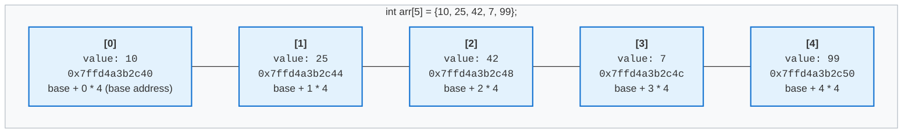
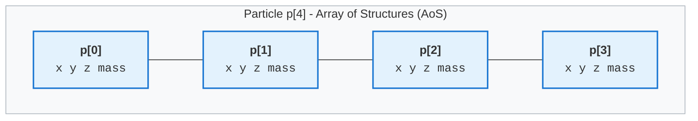
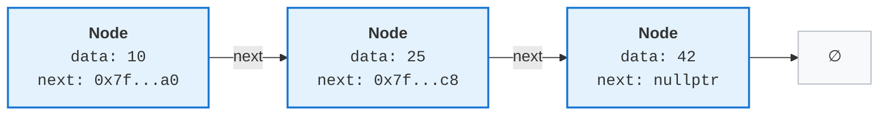
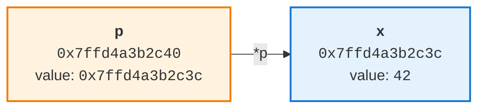
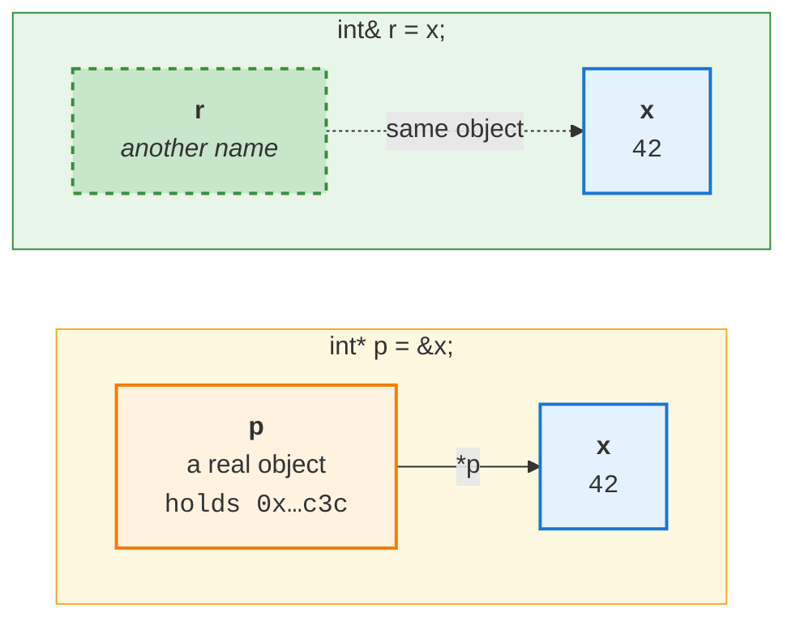

# 2.1 Arrays, Structures & Pointers in C++

> **Why this chapter is all about memory.** In
> [1.1 - Introduction to Data Structures & Algorithms](1.1%20introduction_to_data_structures_algorithm.md)
> we split data structures into two kinds:
>
> - **Physical**:  **Arrays**, **Matrices**, **Linked Lists**. They define how data is *arranged*
>   in memory.
> - **Logical**: Stacks, Queues, Trees, Graphs, Hashing. They define how data is *utilized*.
>
> **This chapter is the physical half, and "physical" is meant literally.** An array *is* a rule
> about addresses `base + i * size`, nothing more. A linked list *is* a rule about which node
> holds the address of the next one. Strip the memory arrangement away and there is no data
> structure left. That is why the pages ahead are full of addresses, bytes, alignment and the
> process address space instead of operations like `push` and `pop`: **for a physical data
> structure, the memory arrangement is the data structure.**
>
> (**Matrices** are the third one on the list, and they need no separate chapter - a matrix is an
> array with more than one index, laid out in the same contiguous block, reached with
> `base + (i * columns + j) * size`.)
>
> The second reason to care: **every logical data structure is built on top of a physical one.**
>
> | Logical structure | Physically, it is… |
> |---|---|
> | Stack, Queue | an array, or a linked list |
> | Tree | linked nodes, or an array (a binary heap) |
> | Graph | an adjacency **matrix** (array), or an adjacency **list** (linked list) |
> | Hashing | an array of buckets, plus linked lists for collisions |
>
> So the two structures in this chapter are the raw material for the entire rest of the course.
> Arrays are section 1; the pointer machinery that makes a linked list possible is sections 2.6
> and 3.

## 1. Arrays - the first physical data structure

An array is a collection of elements of the **same type**, stored in one **contiguous** block of memory.
That contiguous block is not an implementation detail - it *is* the array. This is what makes it a
**physical** data structure.

If you have a set of integers, floats, doubles or longs, you can group them under a single name as an array.


**Define an array**

```c++
// example 1
// define an array variable, and initialize value immedately
int arr[5] = {10, 25, 42, 7, 99};

// example 2
// define an array
long day_in_week[7];
// 2.2 assign value to each array element
day_in_week[0] = 2;
day_in_week[1] = 3;
day_in_week[2] = 4;
day_in_week[3] = 5;
day_in_week[4] = 6;
day_in_week[5] = 7;
day_in_week[6] = 8;
```

Key properties of a built-in (C-style) array:

- All elements have the same type, so every element has the same size (`sizeof(int)` here).
- Elements are laid out back-to-back in memory, which is why the address of element `i` is
  `base_address + i * sizeof(element)`. This is also why indexing is O(1).
- Indexing starts at `0`, so the valid indices of `arr[5]` are `0..4`.
- The size is fixed and must be a compile-time constant; an array cannot grow or shrink.
  Section 1.3 covers the cases where you may leave the number out.
- There is **no bounds checking**. `arr[7]` compiles and is undefined behavior at runtime.
- **An array is not a pointer**, even though it turns into one in almost every expression.
  `arr` names the 20 bytes themselves; there is no hidden 8-byte cell holding an address
  anywhere. Section 3.3 has the full story.



The same array counted in **bytes**, which is what the hardware actually sees. Byte `0` is
`&arr[0]`, the base address:

```text
byte:  0    1    2    3    4    5    6    7
      +----+----+----+----+----+----+----+----+
      |      arr[0]       |      arr[1]       |
      |        10         |        25         |
      +----+----+----+----+----+----+----+----+
byte:  8    9    10   11   12   13   14   15
      +----+----+----+----+----+----+----+----+
      |      arr[2]       |      arr[3]       |
      |        42         |         7         |
      +----+----+----+----+----+----+----+----+
byte:  16   17   18   19
      +----+----+----+----+
      |      arr[4]       |
      |        99         |
      +----+----+----+----+

      every element is 4 bytes wide and starts on a multiple of 4, so there is no padding
      sizeof(arr) = 5 * 4 = 20      useful = 20 bytes      wasted = 0 bytes (0 %)
```

Read the byte numbers down the left of each element and the indexing formula falls out of the
picture: `arr[0]` starts at byte 0, `arr[1]` at byte 4, `arr[2]` at byte 8. Element `i` starts at
byte `i * 4`, so its address is `base + i * sizeof(int)`. **The compiler never searches for an
element, it multiplies** - and that multiplication is why `arr[i]` is O(1) no matter how large the
array is.

It also shows what `arr[7]` really means: byte `28`, which is 8 bytes past the end of the block.
Nothing about the picture stops you from writing there, which is the whole story of section 1.2.

> **The base address is computed, not stored.** This picture is the whole array: 20 bytes of
> elements and nothing else. A common belief is that `arr` is secretly a pointer sitting somewhere,
> holding the address of `arr[0]`. It is not, and you can prove it in one line:
>
> ```c++
> int arr[5];  int* p = arr;
>
> (void*)&arr == (void*)arr;   // true  - the array's own address IS the address of its first element
> (void*)&p   == (void*)p;     // false - the pointer is a separate object, at its own address
>
> sizeof(arr);   // 20, the whole block        sizeof(p);   // 8, just the pointer
> arr = p;       // ERROR: incompatible types in assignment of 'int*' to 'int [5]'
> ```
>
> Those casts are themselves part of the evidence. Written plainly as `&arr == arr`, the compiler
> refuses it: *"comparison between distinct pointer types `int (*)[5]` and `int*` lacks a cast"*.
> The two expressions hold the same address but are **different types**.
>
> What makes `int* p = arr;` work is **decay**: in almost every expression an array converts to a
> pointer to its first element. Converting into something is not the same as being it, and section
> 3.3 shows where the difference bites.


**Size of an array**

We using the `sizeof` operator to calculate the size of element data type, then multiply with the number of elements of an array. `size = number_of_elements * sizeof(element_data_type)`

```c++
#include <iostream>
using namespace std;

int main() {
    int arr_int[5];
    cout << "Size of array int with 5 elements = 5 * sizeof(int) = " << (5 * sizeof(int)) << endl;
    // Size of array int with 5 elements = 5 * sizeof(int) = 20

    short int arr_short_int[5];
    cout << "Size of array short int with 5 elements = 5 * sizeof(short int) = " << (5 * sizeof(int)) << endl;
    // Size of array short int with 5 elements = 5 * sizeof(short int) = 10
    
    long int arr_long_int[5];
    cout << "Size of array long int with 5 elements = 5 * sizeof(long int) = " << (5 * sizeof(long int)) << endl;
    // Size of array long int with 5 elements = 5 * sizeof(long int) = 40

    bool arr_bool[5];
    cout << "Size of array bool with 5 elements = 5 * sizeof(bool) = " << (5 * sizeof(bool)) << endl;
    // Size of array bool with 5 elements = 5 * sizeof(bool) = 5
    return 0;
}
```


**Access array elements**

```c++
#include <iostream>
using namespace std;

int main() {
    int arr_int[2] = {10, 99};
    
    // normal accessing element within the range
    cout << arr_int[0] << endl; // 10
    
    // abnormal accessing element out of range
    cout << arr_int[10] << endl; // print randomization value, not guarantee the returning value
    return 0;
}
```

*Where* that contiguous block lives depends on **where the array is declared**, which is the
subject of the next section.

### 1.1 Where an array actually lives

Nothing in the *type* `int[5]` decides this. **The declaration site does**, the same array
declaration lands in a different region depending only on where you write it:

```c++
#include <iostream>

int global_arr[100] = {1};      // .data  - has a non-zero initializer
int zero_arr[100];              // .bss   - all zeros, so no bytes in the binary
static int static_arr[100];     // .bss   - `static` changes linkage, not storage

// function
void f() {
    int arr[5] = {10, 25, 42, 7, 99};   // stack - gone when f() returns
    int* big = new int[4096];           // heap  - stays until you delete[] it
    delete[] big;
}

int main() {
    f();
    return 0;
}
```

| Declared... | Lives in | Lifetime |
|---|---|---|
| inside a function | **stack** | until the function returns |
| global or `static`, non-zero initializer | **.data** | the whole program |
| global or `static`, zero or no initializer | **.bss** | the whole program |
| with `new` / `malloc()` | **heap** | until `delete[]` / `free()` |

Those four destinations are four different regions of the memory the operating system gives your
program. **For this chapter the table above is all you need.** If you want the full map of a
process's memory - where those regions sit relative to each other, and why the addresses change on
every run - it is drawn in **[Appendix A - How memory really works](appendix_a_how_memory_works.md)**. Nothing in the rest of this chapter depends on it.

### 1.2 What this means for your arrays

Take the arrays from `f()` again, this time with their sizes, plus a third that differs only in its
element type:

```c++
void f() {
    int arr[5] = {10, 25, 42, 7, 99};       // 20 bytes on the stack
    int*    big        = new int[4096];     // 16 KB on the heap
    double* really_big = new double[4096];  // 32 KB on the heap - same count, 8-byte elements

    delete[] big;
    delete[] really_big;
}
```

- `arr` is 20 bytes carved out of the current stack frame by moving the stack pointer. No allocator,
  no bookkeeping - just arithmetic on a register. This is why stack arrays are so cheap.
- `arr` occupies a tiny part of one 4 KB **page**, so all five elements sit in the same page.
- `big` is a heap allocation. The memory it names does not physically exist until you write to it -
  see Appendix A if you want to know why.
- `big` and `really_big` hold the **same number of elements** but occupy 16 KB and 32 KB. The size of
  a block is `count * sizeof(element)`, never the count alone. That is 4 pages against 8, and twice
  as many cache lines to walk through.
- RAM is read in **64-byte cache lines** (on x86-64), so one cache miss brings in 16 `int`s and the
  next 15 accesses are hits. **This is why traversing an array is faster than traversing a linked
  list**, even though both are **O(n)**. It comes back in sections 2.5 and 3.9.
- `int arr[10'000'000];` as a *local* variable is 40 MB, but the default stack limit is 8 MB
  (`ulimit -s`). You get a **stack overflow** and a `SIGSEGV` (Signal Segmentation Violation). That array belongs on the heap.

And the bug from the start of this section now has a precise explanation:

```c++
int arr[5];
arr[7] = 1;    // undefined behaviour
```

`&arr[7]` is still inside the same 4 KB page as `arr[0]`, so the hardware sees a perfectly valid
address and the write succeeds. It simply lands on *whatever else* is in that stack frame - another
variable, or the saved return address. No crash, no warning, and a bug that surfaces somewhere else
entirely. You only get a segmentation fault when you stray far enough to reach an address with **no
valid mapping** - which is a property of pages, not of your array.

> **Going deeper is optional.** Memory protection works per *page*, not per object; that single fact
> explains the behaviour above. If you want the whole machine - the MMU, page tables, the kernel's
> role, page faults, and what `new`/`delete` really do - it is in
> **[Appendix A - How memory really works](appendix_a_how_memory_works.md)**. Nothing in the rest of
> this chapter depends on it.

---

### 1.3 Declaring an array without a size

The bullet above said the size must be a compile-time constant. There are three places where you may
still leave the number out, and it is worth knowing which is which, because only one of them is
really "an array without a size" and **none of them lets you choose the size at run time**.

**1. Deduced from the initializer.** The compiler counts the elements for you:

```c++
int  arr[] = {10, 25, 42, 7, 99};   // becomes int[5]
char s[]   = "hello";               // becomes char[6] - the '\0' counts

sizeof(arr);   // 20
sizeof(s);     // 6
```

Nothing is different about the memory. The type *is* `int[5]`, the size is still a compile-time
constant, and everything in section 1.1 applies unchanged. You did not skip the size, you let the
compiler fill it in. Prefer this form: the size can never disagree with the contents.

**2. `extern` - a declaration, not a definition.** This one allocates nothing at all:

```c++
// a.cpp
int table[] = {1, 2, 3, 4};   // the definition: this is what allocates 16 bytes

// b.cpp
extern int table[];           // a declaration: "it exists somewhere, with this name"
```

`table` in `b.cpp` has an **incomplete type**. Indexing still works, because `table[i]` only needs
the size of one *element*, but the array's own size is unknown here:

```c++
sizeof(table);   // ERROR: invalid application of 'sizeof' to incomplete type 'int []'
```

**3. A function parameter - which is not an array at all.**

```c++
void f(int a[]) { ... }   // this really means int* a; nothing is allocated
```

That is the decay rule, covered properly in section 3.3.

**What you cannot write:**

```c++
int arr[];   // ERROR: storage size of 'arr' isn't known
```

No initializer to count, and no `extern` to defer to, so the compiler has nothing to work with.

#### Choosing the size at run time

This is usually the real question, and the tempting answer is a **variable-length array**:

```c++
int n;
std::cin >> n;
int arr[n];        // VLA
```

**This is not standard C++.** It is a C99 feature that GCC and Clang accept as an extension:

| Compiler / flags | Result |
|---|---|
| `g++ -pedantic-errors` | `error: ISO C++ forbids variable length array 'arr' [-Wvla]` |
| `g++` with default flags | compiles, as a GNU extension |
| MSVC | rejected |

How it allocates is the interesting part. Compare what the compiler emits:

| `int a[5];` | `int a[n];` |
|---|---|
| `sub rsp, 40` - one constant subtraction | compute `n * 4`, round up, then **loop** touching one 4 KB page at a time before moving `rsp` |

A fixed array costs a single instruction because the amount is known while compiling. A VLA has to
compute the amount at run time and, since it may span several pages, **probe** each page in order so
that the stack guard page is hit predictably instead of jumped over. It also forces the function to
keep a frame pointer, because `rsp` is no longer at a known offset.

Two reasons not to use it:

- **It cannot fail gracefully.** If `n` is ten million, that is 40 MB against a default 8 MB stack
  (section 1.2), so you get a stack overflow and a `SIGSEGV`. There is no error you can catch.
- **It is not portable.** Code using it will not build with MSVC, or with `-pedantic-errors`.

What to use instead:

```c++
int* p = new int[n];        // heap, and you are responsible for delete[]
std::vector<int> v(n);      // heap, and it is responsible  <- the real answer
```

`std::vector` is the honest version of "an array whose size I decide at run time": it is
heap-allocated, it knows its own size, it throws `std::bad_alloc` instead of corrupting the stack,
and it can grow. We build one from scratch later in the course.

---
## 2. Structures

An array groups elements of the **same** type. A structure groups elements of **different** types
under one name, so that they can be handled as a single object.

```c++
// Example 1: define a struct Student only
struct Student {
    int    id;
    char   grade;
    double gpa;
};

// Declare variable s type struct Student
struct Student s;          // in C++ you write `Student`, not `struct Student`
s.id    = 101;
s.grade = 'A';
s.gpa   = 3.75;

// you can avoid using struct keyword to declare a struct variable
Student s2;

// Example 2: define a struct Animal and declare a variable
struct Animal {
    short age;
    char* name;
} dog;
// assign value to struct fields
dog.age = 3;
dog.name = new char[5]("Bob");


// Example 3: define a struct Rectangle and also declare two variables, initialize data for each of them
struct Rectangle {
    int width;
    int height;
} rect1 = {6, 8}, rect2 = {2, 4 };

// accessing struct fields via its name
cout << rect1.width << ":" << rect1.height << endl; // 6:8
cout << rect2.width << ":" << rect2.height << endl; // 2:4

// Example 4: Nested struct
struct Job {
    char* name;
};
struct Person {
    char* name;
    short age;
    Job job[4] = {{"Doctor"}, {"Firefighter"}, {"Engineering"}, {"Soldier"}};
    short days_of_week[7] = {2, 3, 4, 5, 6, 7, 8};
};
```

The members of a structure are called **fields** or **members**. Unlike an array, they are accessed
by *name*, not by index, there is no `s[0]`, because the members have different types and different
sizes, so `base + i * sizeof(element)` would be meaningless.

That difference has a consequence for size. An array is exactly `n * sizeof(element)`; a structure
is the sum of its members **plus padding** - and the padding is where the interesting part is.

### 2.1 Memory layout, alignment and padding

Members are laid out in **declaration order**, at increasing addresses. But they are *not* always
packed back-to-back, because the hardware imposes **alignment** requirements: an object of a type
with alignment `A` must start at an address that is a multiple of `A`.

On x86-64 Linux (System V ABI):

| Type | `sizeof` | `alignof` |
|---|---|---|
| `char`, `bool` | 1 | 1 |
| `short` | 2 | 2 |
| `int`, `float` | 4 | 4 |
| `long`, `double`, any pointer | 8 | 8 |

The compiler inserts unused **padding** bytes to satisfy those requirements. Consider:

```c++
struct A {
    char   a; // 1 bytes
    double b; // 8 bytes
    char   c; // 1 bytes
};

static_assert(sizeof(A)  == 24);
static_assert(alignof(A) ==  8);
```

`alignof(A)` is 8, inherited from the `double`, and that is what turns 10 bytes of data into 24:
`a` and `c` each end up sitting alone in an 8-byte row.

```text
byte:  0    1    2    3    4    5    6    7
      +----+----+----+----+----+----+----+----+
      | a  | ## | ## | ## | ## | ## | ## | ## |
      +----+----+----+----+----+----+----+----+
byte:  8    9    10   11   12   13   14   15
      +----+----+----+----+----+----+----+----+
      | b  | b  | b  | b  | b  | b  | b  | b  |
      +----+----+----+----+----+----+----+----+
byte:  16   17   18   19   20   21   22   23
      +----+----+----+----+----+----+----+----+
      | c  | ## | ## | ## | ## | ## | ## | ## |
      +----+----+----+----+----+----+----+----+

      ## = padding      sizeof(A) = 24      useful = 10 bytes      wasted = 14 bytes (58 %)
```

**Reordering members from largest to smallest alignment removes most padding:**

```c++
struct B {
    double b;
    char   a;
    char   c;
};

static_assert(sizeof(B) == 16);   // same data, 8 bytes smaller
```

```text
byte:  0    1    2    3    4    5    6    7
      +----+----+----+----+----+----+----+----+
      | b  | b  | b  | b  | b  | b  | b  | b  |
      +----+----+----+----+----+----+----+----+
byte:  8    9    10   11   12   13   14   15
      +----+----+----+----+----+----+----+----+
      | a  | c  | ## | ## | ## | ## | ## | ## |
      +----+----+----+----+----+----+----+----+

      ## = padding      sizeof(B) = 16      useful = 10 bytes      wasted = 6 bytes (38 %)
```

24 → 16 bytes is a 33 % saving, for free. In a data structure holding a million nodes that is 8 MB
of RAM and, more importantly, 8 MB less traffic through the caches described in section 1.2.

#### BAD vs GOOD: the same six fields, 40 bytes or 24

`struct A` was a teaching toy. Here is the same mistake in code you would actually write, and then
the *identical* fields sorted by descending `alignof`:

```c++
// BAD - declaration order follows the train of thought
struct Packet {
    bool   is_valid;    // alignof 1
    double timestamp;   // alignof 8  <- cannot start at 1, so 7 bytes of padding before it
    char   type;        // alignof 1
    int    length;      // alignof 4  <- cannot start at 17, so 3 more
    char*  payload;     // alignof 8
    short  checksum;    // alignof 2  <- then 6 bytes of tail padding to round 34 up to 40
};
static_assert(sizeof(Packet) == 40);   // 24 bytes of data, 16 bytes of air

// GOOD - declaration order follows alignment: 8, 8, 4, 2, 1, 1
struct Packet {
    double timestamp;
    char*  payload;
    int    length;
    short  checksum;
    bool   is_valid;
    char   type;
};
static_assert(sizeof(Packet) == 24);   // 24 bytes of data, no padding at all
```

The GOOD version has no holes because the members only ever get *smaller*: each one lands on an
offset that already satisfies its alignment, so the compiler never has to skip bytes to reach it,
and the 1- and 2-byte members at the end fill the space that rounding the total up to 24 would have
wasted anyway.

```text
byte:  0    1    2    3    4    5    6    7
      +----+----+----+----+----+----+----+----+
      |          timestamp (double)           |
      +----+----+----+----+----+----+----+----+
byte:  8    9    10   11   12   13   14   15
      +----+----+----+----+----+----+----+----+
      |           payload (char*)             |
      +----+----+----+----+----+----+----+----+
byte:  16   17   18   19   20   21   22   23
      +----+----+----+----+----+----+----+----+
      |    length (int)   | ck | ck | v  | t  |
      +----+----+----+----+----+----+----+----+

      no padding      sizeof(Packet) = 24      useful = 24 bytes      wasted = 0 bytes (0 %)
```

**40 -> 24 bytes, a 40 % saving, for nothing.** Every offset is still a compile-time constant, so
`p->length` costs exactly what it did before. Across a million packets that is 40 MB against 24 MB,
and 40 % fewer cache lines dragged through memory by any loop that walks them.

#### Tips whenever you define a new struct

1. **Declare members in descending order of `alignof`**: 8-byte members (`double`, `long`, every
   pointer) first, then 4 (`int`, `float`), then 2 (`short`), then 1 (`char`, `bool`).
2. **Sort by alignment, not by size.** `char buf[100]` is 100 bytes with `alignof` 1, so it belongs
   at the end next to the `char`s, not at the front with the pointers.
3. **Check it.** Add up `sizeof` of every member and compare with `sizeof` of the struct - the
   difference *is* the padding. `g++ -Wpadded` points at every hole it inserted.
4. **Pin the size** with `static_assert(sizeof(Node) == 16);` next to the definition, so a future
   "just one more `bool`" is a compile error instead of silent growth across a million nodes.
5. **Shrink the members before reordering them.** A field that only holds 0..200 does not need an
   `int`; `std::uint8_t` is 1 byte. Reordering rearranges the waste, a smaller type removes it.
6. **Reordering changes positional initialization.** `Packet p{true, 1.5, ...}` means something
   different after a shuffle, so use designated initializers (`.timestamp = 1.5`) or fix the call
   sites. The same applies if the bytes go straight to a file or a socket.
7. **It only matters at scale.** For a struct you create once, declare the members in whatever order
   reads best. For an array element or a linked-list node, order them by alignment.

> **One trap worth knowing.** `char *name` is **8 bytes, not 1** - it holds an address, and the
> characters live somewhere else, so `struct { char *name; int age; }` is 16 bytes with `alignof` 8.
> And `alignof(char[10])` is **1, not 10**: an array's alignment is its *element's* alignment, never
> its size.

#### Do not "fix" padding with `#pragma pack`

```c++
#pragma pack(push, 1)
struct Packed { char a; double b; char c; };   // sizeof == 10
#pragma pack(pop)
```

This is occasionally necessary for on-disk or on-the-wire formats, but it is not free: `b` is now at
offset 1, so reading it is an **unaligned access** - slower on x86-64, a fault on some
architectures, and taking a pointer or reference to a misaligned member is undefined behaviour.
Reorder your members instead; use packing only when an external format forces your hand.

### 2.2 Creating and initializing structures

```c++
struct Point { int x = 0; int y = 0; };   // default member initializers

Point p1;              // members default-initialized - here 0 and 0, from the initializers above
Point p2{};            // value-initialized - zeroes members even without default initializers
Point p3{3, 4};        // aggregate initialization, in declaration order
Point p4{.x = 3, .y = 4};   // C++20 designated initializers - must follow declaration order
```

> A plain `Student s;` at block scope leaves `id`, `grade` and `gpa` **uninitialized** - they hold
> whatever bytes were already on the stack. `Student s{};` zeroes them. This is the structure
> version of the uninitialized-variable problem.

### 2.3 Structures in memory, and passing them around

A structure obeys exactly the same rules as any other object - where it lives depends on where it is
declared (section 1.1):

```c++
Student global_s;                       // .bss  (zero-initialized)
Student init_s{1, 'A', 4.0};            // .data

void f() {
    Student local_s;                    // stack
    Student* heap_s = new Student;      // heap
    delete heap_s;
}
```

Two access operators, and the distinction is purely about what you are holding:

```c++
Student  s;
Student* p = &s;

s.gpa       = 3.9;    // `.`  on an object
p->gpa      = 3.9;    // `->` on a pointer  -  shorthand for (*p).gpa
```

Assignment and copying work member-wise out of the box:

```c++
Student t = s;        // copies every member
```

But be aware of the cost: passing a structure **by value** copies all of it, padding included. A
`Student` is only 16 bytes, but a structure holding a large array copies the whole array on every
call. Prefer `const Student&` for read-only parameters - covered properly in section 5.

### 2.4 Two padding traps

**Comparison is not automatic.** `s == t` does not compile for a plain structure before C++20. In
C++20 you can ask for it:

```c++
struct Point {
    int x, y;
    bool operator==(const Point&) const = default;   // C++20: member-wise comparison
};
```

**Never compare structures with `memcmp`.** Padding bytes are *indeterminate* - two structures whose
members are all equal can hold different garbage in their padding, so `memcmp` may report them as
different. The same trap applies to using a structure as a raw hash key: hash the members, not the
bytes.

### 2.5 Array of structures - and why the reverse sometimes wins

An array of structures is just what it sounds like: elements of identical size laid end-to-end,
where each element happens to be a structure.

```c++
struct Particle { float x, y, z, mass; };   // 16 bytes, no padding
Particle p[1000];                           // 16 000 bytes, stride 16
```



Now recall from section 1.2 that RAM is read in 64-byte cache lines. That makes the *layout choice*
measurable:

```text
AoS - struct Particle { float x, y, z, mass; };  Particle p[N];

  memory:  x0 y0 z0 m0 | x1 y1 z1 m1 | x2 y2 z2 m2 | x3 y3 z3 m3 | ...
           └─────────────────── one 64-byte cache line ──────────────┘

  A loop that reads only .x pulls in 16 floats and uses 4 of them - 75 % of the
  memory bandwidth is wasted.

SoA - struct Particles { float x[N], y[N], z[N], mass[N]; };

  memory:  x0 x1 x2 x3 x4 ... x15 | ... | y0 y1 ... | z0 ... | m0 ...
           └────── one 64-byte cache line = 16 useful values ──────┘
```

Neither layout is universally better:

- **AoS** wins when you touch *most fields of one element* - `p[i].x += p[i].vx;`, or when you sort,
  insert or move whole elements.
- **SoA** wins when you sweep *one field across all elements* - summing every `x`, or applying the
  same operation to a whole column. It also vectorizes (SIMD) far better.

This is the same principle as "arrays beat linked lists for traversal": the algorithm's O() is
unchanged, but the number of cache lines touched is not.

### 2.6 Self-referential structures - the bridge to every node-based structure

A structure **cannot contain itself by value** - the size would be infinite:

```c++
struct Node {
    int  data;
    Node next;    // ERROR: 'Node' is an incomplete type; sizeof would be infinite
};
```

But it *can* contain a **pointer** to itself, because a pointer has a fixed size (8 bytes) no matter
what it points at:

```c++
struct Node {
    int   data;
    Node* next;   // OK - Node is incomplete here, but a pointer to it is fine
};
```

That single line is the foundation of linked lists, trees, graphs and hash-table buckets - every
data structure in this course that is not an array.

It is also where the **second physical data structure** appears. An array arranges data by putting
elements *next to each other*; a linked list arranges it by having each element *store the address
of the next*. Those are the only two arrangements there are, and `Node* next;` is the whole of the
second one.

Its layout is a good final exercise on section 2.1:

```text
byte:  0    1    2    3    4    5    6    7
      +----+----+----+----+----+----+----+----+
      |      data (int)   | ## | ## | ## | ## |
      +----+----+----+----+----+----+----+----+
byte:  8    9    10   11   12   13   14   15
      +----+----+----+----+----+----+----+----+
      |            next (Node*, 8 bytes)      |
      +----+----+----+----+----+----+----+----+

      ## = padding      sizeof(Node) = 16      useful = 12 bytes      wasted = 4 bytes (25 %)
```

A linked list of one million `int`s therefore costs 16 MB, versus 4 MB for `int[1'000'000]` - and
those 16 MB are scattered across the heap, so almost every `->next` is a fresh cache line, whereas
the array is read sequentially. Keep this in mind when we compare the two in the next chapters.



Note that the three nodes are drawn next to each other only for convenience. In reality each one
comes from a separate `new`, so they can be anywhere in the heap - the *logical* order of the list
has nothing to do with the *physical* order in memory. That is precisely the trade-off a linked list
makes: cheap insertion, expensive traversal.

## 3. Pointers

A pointer is a variable whose **value is an address**.

That is the entire idea. Everything else in this section follows from it. A pointer is not a special
kind of thing the language invents - it is an ordinary variable, stored in ordinary memory, that
happens to hold the virtual address of something else.

```c++
int  x = 42;
int* p = &x;     // p holds the address of x

std::println("{} {}", (void*)p, *p);   // 0x7ffd4a3b2c3c  42
```

Two operators do all the work:

| Operator | Name | Meaning |
|---|---|---|
| `&x` | address-of | "give me the address where `x` lives" |
| `*p` | dereference (indirection) | "give me the object at the address in `p`" |

They are inverses: `*&x` is `x`.



> **A declaration trap.** The `*` binds to the *declarator*, not to the type:
>
> ```c++
> int* a, b;      // a is int*, b is plain int  ← almost never what you meant
> int *a, *b;     // both are int*
> int* a; int* b; // clearest: one declaration per line
> ```

### 3.1 What a pointer actually holds

A pointer is just a number - an index into the process's virtual address space
([Appendix A](appendix_a_how_memory_works.md) draws it, if you are curious).
You can look at its bytes:

```c++
int  x = 42;     // suppose it lands at 0x7ffd4a3b2c3c
int* p = &x;     // and p itself lives at 0x7ffd4a3b2c40
```

```text
 p  (8 bytes, at 0x7ffd4a3b2c40)                  x  (4 bytes, at 0x7ffd4a3b2c3c)
 +----+----+----+----+----+----+----+----+        +----+----+----+----+
 | 3c | 2c | 3b | 4a | fd | 7f | 00 | 00 |        | 2a | 00 | 00 | 00 |
 +----+----+----+----+----+----+----+----+        +----+----+----+----+
   least significant byte first (little-endian)     42 == 0x0000002a
   value = 0x00007ffd4a3b2c3c
```

Two consequences that trip people up:

**Every pointer is the same size**, because every virtual address is the same size:

```c++
static_assert(sizeof(char*)   == 8);
static_assert(sizeof(double*) == 8);
static_assert(sizeof(void(*)()) == 8);   // even a function pointer
```

A pointer to a 1-byte `char` and a pointer to a 10 MB array are both 8 bytes on x86-64. This is
exactly why `Node* next;` works in section 2.6 while `Node next;` cannot.

**So what is the type for?** The pointed-to type is not stored anywhere at run time. It is purely
compile-time information telling the compiler two things:

1. how to **interpret** the bytes at the target (`*p` of an `int*` reads 4 bytes as an integer)
2. how far to **move** for pointer arithmetic (`p + 1` advances by `sizeof(int)`)

`void*` is the pointer that has thrown that information away: it holds an address and nothing else,
so it can be neither dereferenced nor incremented. It is how `malloc` returns "memory, you decide
what it is".

**Null pointers.** `nullptr` (C++11) is the one address guaranteed to point at no object:

```c++
int* p = nullptr;      // prefer this
int* q = NULL;         // C-style macro, usually 0 - avoid in C++
int* r = 0;            // legal but confusing
*p = 1;                // undefined behaviour → in practice SIGSEGV
```

And now you know *why* dereferencing null reliably crashes, which is not obvious: there is nothing
magical about the value 0. It crashes because the kernel **deliberately leaves the lowest page of
every address space unmapped** (on Linux, `vm.mmap_min_addr`, 64 KB by default). Address 0 has no
page-table entry, the MMU raises a fault, the kernel finds no VMA covering it, and turns that into
`SIGSEGV`. Null dereference is just the page-fault machinery of [Appendix A](appendix_a_how_memory_works.md) doing its job.

> This also explains the asymmetry that confuses students: `*p` where `p == nullptr` crashes
> immediately and reliably, while `arr[7]` on an `int arr[5]` usually does *not* crash. One targets
> a deliberately unmapped page; the other is still inside a perfectly valid one.

### 3.2 Pointer arithmetic

Adding to a pointer moves it in **units of the pointed-to type**, not bytes:

```c++
int arr[5] = {10, 25, 42, 7, 99};
int* p = arr;        // points at arr[0]

p + 1                // address + 4  (sizeof(int)), NOT address + 1
p + 3                // address + 12
```

```text
       p        p+1      p+2      p+3      p+4       p+5
       |        |        |        |        |         |
       v        v        v        v        v         v
     +--------+--------+--------+--------+--------+  .
     |   10   |   25   |   42   |    7   |   99   |  . one-past-the-end
     +--------+--------+--------+--------+--------+  .
  0x...c40  0x...c44 0x...c48 0x...c4c 0x...c50   0x...c54
```

This is the same `base + i * sizeof(element)` formula from section 1 - the compiler is doing the
multiplication for you.

| Expression | Result | Notes |
|---|---|---|
| `p + n`, `p - n` | pointer | moves `n * sizeof(T)` bytes |
| `p2 - p1` | `std::ptrdiff_t` | number of **elements** between them, not bytes |
| `p1 < p2`, `p1 == p2` | `bool` | meaningful only within one array |
| `++p`, `p += n` | pointer | the usual traversal idiom |

Two rules that are easy to break by accident:

- Pointer arithmetic is only defined **inside one array**, plus the one-past-the-end position. You
  may *form* and *compare* `arr + 5`, but dereferencing it is undefined behaviour. That is what
  makes `for (int* it = arr; it != arr + 5; ++it)` legal - and it is exactly how iterators work.
- To do byte arithmetic, cast to `char*` (or `std::byte*`), because `sizeof(char) == 1`.

### 3.3 Arrays and pointers are not the same thing

This is the single most misunderstood corner of C++, so it is worth being exact.

In almost every expression, an array **decays**: the array name converts to a pointer to its first
element.

```c++
int arr[5];
int* p = arr;        // decay: same as &arr[0]
```

Because of that, indexing is *defined* in terms of pointer arithmetic:

```c++
arr[i]  ≡  *(arr + i)  ≡  *(i + arr)  ≡  i[arr]    // yes, 3[arr] compiles and works
```

`i[arr]` is a party trick, but it makes the point: `[]` is not a special array operator, it is
syntax sugar over pointer arithmetic.

**But an array is not a pointer.** The differences are visible:

```c++
int arr[5];
int* p = arr;

sizeof(arr);      // 20 - the whole array
sizeof(p);        //  8 - just the pointer

&arr;             // type int(*)[5]  - pointer to array of 5 int
&arr[0];          // type int*       - pointer to int
                  // same address, different types!

arr + 1;          // advances 4 bytes  (next int)
&arr + 1;         // advances 20 bytes (past the whole array)

arr = p;          // ERROR - an array name is not assignable
```

**What decay costs you: the size.** The moment an array is passed to a function, it becomes a bare
pointer and the length is gone:

```c++
void f(int a[5]) {          // the 5 is a comment; this really means int* a
    sizeof(a);              // 8, not 20 - a is a pointer here
}

void g(int* a, std::size_t n);   // honest: you must pass the length
```

```c++
int arr[5];
std::size_t n = sizeof(arr) / sizeof(arr[0]);   // 5 - correct HERE
f(arr);                                          // inside f, the same formula gives 2
```

That silent `20/4 = 5` turning into `8/4 = 2` is a classic source of buffer overruns. Modern C++
gives you two fixes:

```c++
std::size(arr);              // C++17 - compile error if arr has decayed
std::span<int> s{arr};       // C++20 - a pointer AND a length, passed together
void h(std::span<int> s);    // now the callee knows the size
```

> The compiler can catch the decay trap for you. `g++ -Wall` already warns:
> `'sizeof' on array function parameter 'a' will return size of 'int*'`
> (`-Wsizeof-array-argument`). Treat that warning as an error - it is almost always a real bug.

For DSA work, `std::array<int, 5>` and `std::vector<int>` carry their size and should be your
default; raw arrays are for understanding what those are built on.

### 3.4 Pointers to structures

Pointers become genuinely necessary once structures are involved. From section 2:

```c++
Student  s{101, 'A', 3.75};
Student* p = &s;

(*p).gpa = 3.9;    // works, but the parentheses are required and ugly
p->gpa   = 3.9;    // identical meaning - always written this way
```

`->` is nothing more than a dereference followed by a member access. Under the hood the compiler
turns `p->gpa` into "take the address in `p`, add the compile-time offset of `gpa` (8 bytes, from
section 2.1), and read 8 bytes as a `double`". Member access is a *fixed offset* - that is why it
costs nothing.

### 3.5 Dynamic memory: `new` and `delete`

Everything so far had a lifetime the compiler controlled. Pointers exist so that you can create
objects whose lifetime **you** control, in the heap from the table in section 1.1.

```c++
int*  one  = new int(42);       // single object
int*  many = new int[1000];     // array of 1000
Node* n    = new Node{10, nullptr};

delete   one;      // single object   → delete
delete[] many;     // array           → delete[]
delete   n;
```

| Rule | Why |
|---|---|
| `new` pairs with `delete`; `new[]` pairs with `delete[]` | mismatching them is undefined behaviour |
| `delete nullptr` is safe | it is a guaranteed no-op, so no need to test first |
| after `delete`, the pointer is **dangling** | the memory is gone but the pointer still holds the old address |

Recall from [Appendix A](appendix_a_how_memory_works.md) what `new` actually does: it calls `malloc`, which usually just
hands back a chunk of an arena it already owns - no kernel, no system call. The memory only becomes
physically real on first touch.

**The three classic bugs**, and what each looks like at the page level:

```c++
int* p = new int[100];
delete[] p;
p[0] = 1;              // (1) use-after-free
delete[] p;            // (2) double free
                       // (3) leak: forget delete[] entirely
```

1. **Use-after-free** is the dangerous one, and the reason is the memory layout: `free` returns the
   chunk to the allocator's arena, but *the pages stay mapped in the process*. The MMU sees a
   perfectly valid page and raises no fault, so the write silently corrupts whatever the allocator
   has since handed to someone else. No crash, no warning - just wrong answers later, somewhere else.
2. **Double free** corrupts the allocator's own bookkeeping; glibc often detects it and aborts.
3. **Leaks** do not crash either. The process's heap keeps growing, so RSS climbs and the kernel
   eventually swaps or invokes the OOM killer.

> Tools find all three, and they should be part of the workflow from day one:
>
> ```bash
> g++ -fsanitize=address,undefined -g prog.cpp && ./a.out
> valgrind --leak-check=full ./a.out
> ```

### 3.6 `const` and pointers

There are two independent things you can freeze: the **pointee** and the **pointer**.

```c++
int x = 1, y = 2;

const int* p1 = &x;       // pointer to const int
p1 = &y;                  // OK   - may point elsewhere
*p1 = 5;                  // ERROR - may not modify the target

int* const p2 = &x;       // const pointer to int
p2 = &y;                  // ERROR - may not point elsewhere
*p2 = 5;                  // OK    - may modify the target

const int* const p3 = &x; // both frozen
```

**Read the declaration right to left**, and `const` applies to whatever is on its left (unless it is
leftmost, when it applies to the right):

- `const int* p` → "p is a pointer to an int that is const"
- `int* const p` → "p is a const pointer to an int"
- `int const* p` → identical to the first; some people prefer it because the right-to-left rule then
  always works

`const T*` is how you say "I will read this and not modify it", and it is the default for parameters
in section 5.

### 3.7 Pointers to pointers

A pointer is an object with an address, so you can point at one:

```c++
int    x = 42;
int*   p = &x;
int**  pp = &p;

**pp = 7;        // writes to x
```

This is not an academic curiosity - it is how you write clean linked-list code. Compare removing a
node with and without it:

```c++
// Without: the head is a special case that needs its own branch
void remove(Node*& head, int value) {
    if (!head) return;
    if (head->data == value) { Node* d = head; head = head->next; delete d; return; }
    for (Node* cur = head; cur->next; cur = cur->next)
        if (cur->next->data == value) { Node* d = cur->next; cur->next = d->next; delete d; return; }
}

// With: "the pointer that points at this node", so the head is not special at all
void remove(Node** head, int value) {
    for (Node** cur = head; *cur; cur = &(*cur)->next)
        if ((*cur)->data == value) { Node* d = *cur; *cur = d->next; delete d; return; }
}
```

The second version has no special case because `head` and some node's `next` field are both just
"a `Node*` that needs updating". Holding the *address of the pointer* erases the difference.

### 3.8 What to actually use in modern C++

Raw owning pointers are error-prone, and every bug in section 3.5 comes from a human having to
remember something. The standard library remembers for you:

| Use | Tool |
|---|---|
| Unique ownership of a heap object | `std::unique_ptr<T>` via `std::make_unique<T>(...)` |
| Shared ownership | `std::shared_ptr<T>` via `std::make_shared<T>(...)` |
| A dynamic array | `std::vector<T>` |
| A fixed-size array | `std::array<T, N>` |
| A view of somebody else's array | `std::span<T>` |
| A **non-owning** reference to one object | a raw `T*`, or `T&` |

```c++
auto n = std::make_unique<Node>(10, nullptr);   // freed automatically
```

Raw pointers remain completely legitimate for *observing* something you do not own. The rule of
thumb: **a raw pointer should never be the thing responsible for calling `delete`.**

In this course we will keep writing `new`/`delete` in the data-structure chapters, because the whole
point is to see the machinery. Just be clear that in production code you would reach for the
container or the smart pointer.

### 3.9 Why pointers matter for data structures

Arrays gave us O(1) indexing at the cost of a fixed, contiguous block. Pointers buy the opposite
trade: memory that does not have to be contiguous, and structures that can grow one node at a time.

| | Array | Pointer-linked structure |
|---|---|---|
| Memory | one contiguous block | scattered nodes |
| Access element `i` | O(1), arithmetic | O(n), follow `next` |
| Insert in the middle | O(n), shift everything | O(1) once you hold the pointer |
| Grow | reallocate and copy | allocate one node |
| Cache behaviour | excellent, prefetcher-friendly | poor, a miss per node |
| Extra memory | none | one pointer (8 bytes) per node |

Those two columns are the two physical data structures from
[1.1](1.1%20introduction_to_data_structures_algorithm.md): the **array** and the **linked list**.
Every logical structure in the rest of this course - stack, queue, tree, graph, hash table - is
built by picking one of these two columns, and the choice is made with pointers.

## 4. References

A reference is an **alias**: a second name for an object that already exists.

```c++
int  x = 42;
int& r = x;      // r is another name for x - not a copy, not a pointer

r = 7;           // writes to x
std::println("{} {}", x, r);   // 7 7
&r == &x;        // true - same object, same address
```

Where a pointer *holds* an address and needs `*` to reach the object, a reference simply **is** the
object as far as your code is concerned. There is no `*`, no `->`, and nothing to dereference.



### 4.1 The three rules

Everything awkward about references follows from three restrictions that pointers do not have.

**1. A reference must be initialized.**

```c++
int& r;          // ERROR - a reference has to alias something from birth
int& r = x;      // OK
```

**2. A reference can never be reseated.** This is the rule people get wrong:

```c++
int x = 1, y = 2;
int& r = x;

r = y;           // does NOT make r refer to y
                 // it assigns y's VALUE into x  →  x == 2
```

Once bound, a reference refers to that object for its entire life. Any use of `r` - including
assignment - is a use of `x`. There is no syntax to say "now alias something else", because that is
precisely what pointers are for.

**3. There is no null reference.** A reference is guaranteed to alias an object:

```c++
int* p = nullptr;      // fine, and testable
int& r = *p;           // undefined behaviour - never do this
```

This is why `if (r)` is not a thing you write. A reference that arrives in your function is assumed
to be valid, which removes an entire class of checks.

> Three more things that simply do not exist, all for the same reason - a reference is not an object
> with its own storage: **no pointer to a reference**, **no array of references**, and **no
> reference to `void`**.

### 4.2 What a reference costs

The standard describes a reference as an alias and does not require it to occupy any storage. That
shows up directly in `sizeof`:

```c++
int  x = 42;
int& r = x;

sizeof(x);      // 4
sizeof(r);      // 4  - the size of the REFERRED-TO type, not of a pointer
sizeof(int&);   // 4
sizeof(int*);   // 8
```

`sizeof(r)` being 4 catches almost everyone. You are not measuring "the reference"; you are
measuring `x`.

In practice a compiler implements a reference as a pointer **whenever it has to exist at run time** -
a reference parameter in a function that is not inlined, or a reference stored inside a class:

```c++
struct Holder { int& ref; };
sizeof(Holder);   // 8 on x86-64 - one pointer's worth
```

But when the compiler can see through the alias, it emits nothing at all. A reference passed to an
inlined function typically costs exactly zero instructions, which is why `const T&` parameters are
free for the caller.

> A reference **member** has a consequence worth knowing: because it can never be reseated, a class
> containing one cannot be copy-assigned - the implicit `operator=` is deleted. If you want a
> rebindable member, store a pointer (or `std::reference_wrapper`).

### 4.3 References vs pointers

| | Pointer `T*` | Reference `T&` |
|---|---|---|
| Must be initialized | no | **yes** |
| Can be reseated | **yes** | no |
| Can be null | **yes** | no |
| Can be `const`-qualified itself | `T* const` | not applicable - always "const" |
| Arithmetic (`p + 1`) | **yes** | no |
| Arrays of them | **yes** | no |
| `sizeof` | 8 (the pointer) | size of the referred-to type |
| Syntax at the call site | `f(&x)`, and `*p` / `p->m` to use | `f(x)`, and `r` / `r.m` to use |

**The rule of thumb.** Use a **reference** when the thing must always be there and never changes
target. Use a **pointer** when it may be absent (`nullptr`), must be reseated, or you need to do
arithmetic over an array.

This maps onto the two versions of list removal from section 3.7. That code used `Node**` - here is
the same function with a reference instead:

```c++
// pointer-to-pointer: what C forces you to write
void remove(Node** head, int value);
remove(&list, 7);

// reference-to-pointer: the same power, with the indirection hidden
void remove(Node*& head, int value) {
    for (Node** cur = &head; *cur; cur = &(*cur)->next)
        if ((*cur)->data == value) { Node* d = *cur; *cur = d->next; delete d; return; }
}
remove(list, 7);
```

`Node*&` reads as (right to left) "a reference to a pointer to `Node`" - the caller's pointer
itself, so the function can change where the caller's `head` points. The `&` at the call site
disappears, which is either a convenience or a trap depending on your taste: you can no longer tell
from `remove(list, 7)` that `list` may be modified. Pointers make the mutation visible; references
make the code cleaner. Pick one and be consistent.

### 4.4 `const` references and temporaries

A `const` reference is the workhorse of C++, because it accepts things a plain `T&` cannot:

```c++
void by_value(std::string s);          // copies
void by_ref(std::string& s);           // must be given a real, modifiable object
void by_const_ref(const std::string& s);  // reads anything, copies nothing

std::string name = "Ada";
by_const_ref(name);           // OK - an lvalue
by_const_ref("Grace");        // OK - a temporary std::string is created and bound
by_ref("Grace");              // ERROR - cannot bind a non-const reference to a temporary
```

That last error is a feature. If it were allowed, you would be modifying an object that is about to
be destroyed, and your change would silently vanish.

**Lifetime extension.** Binding a temporary to a `const` reference extends that temporary's life to
match the reference:

```c++
const std::string& s = std::string("hello");   // the temporary lives as long as s
std::println("{}", s);                          // safe
```

But this does **not** reach through a function return, which is the classic way to produce a dangling
reference:

```c++
const std::string& bad() {
    return std::string("oops");   // the temporary dies when bad() returns
}                                 // g++ warns: -Wreturn-local-addr
```

### 4.5 The one bug to memorise: dangling references

A reference is only as valid as the object it aliases. Nothing in the language keeps that object
alive for you.

```c++
int& broken() {
    int local = 42;
    return local;      // local dies here - the caller gets a reference to nothing
}

int& also_broken(std::vector<int>& v) {
    v.push_back(1);
    return v[0];       // fine today, but any later push_back may reallocate
}                      // and leave every outstanding reference dangling
```

The second one is the sneaky version and it matters for data structures: `std::vector` stores its
elements in one contiguous block, so when it grows it allocates a new block and copies. Every
reference, pointer and iterator into the old block is instantly invalid - a use-after-free wearing
friendlier syntax.

| Operation | References into a `vector` survive? |
|---|---|
| `v[i] = x`, reading, sorting | yes |
| `push_back` / `insert` that triggers reallocation | **no - all invalidated** |
| `erase` | elements at or after the erase point are invalidated |
| `reserve(n)` beyond current capacity | **no - all invalidated** |

> `g++ -fsanitize=address` catches both of the functions above at run time, and `-Wall` catches the
> first at compile time. Turn them on.

### 4.6 Where references show up every day

**Range-based `for`** - the choice of `&` here is a correctness decision, not a style one:

```c++
std::vector<int> v{1, 2, 3};

for (int x : v)          x *= 2;   // copies; v is UNCHANGED
for (int& x : v)         x *= 2;   // modifies v in place
for (const int& x : v)   sum += x; // reads, no copies - the default for big elements
for (auto&& x : v)       ...       // the generic form; also works for proxy types
```

For cheap types like `int`, `for (int x : v)` is fine. For `std::string` or a large struct,
`const auto&` avoids a copy per iteration.

**Operators that must return a reference.** This is why `v[i] = 5` works at all:

```c++
int& operator[](std::size_t i);              // returns an alias into the container
const int& operator[](std::size_t i) const;  // read-only version
```

If `operator[]` returned by value you would get a copy, and assigning to it would be meaningless.
Every container you write in this course will need this pair.

**Parameter passing** is the biggest use of all, and it gets its own treatment in section 5.

### 4.7 Rvalue references - a first look

C++11 added a second kind of reference, written `T&&`, which binds to **temporaries** (objects about
to be destroyed) rather than to named objects:

```c++
void take(const std::string& s);   // binds to anything; copies if it needs to keep it
void take(std::string&& s);        // binds only to temporaries; free to steal their contents
```

The point is to allow **moving** instead of copying. A `std::vector` of a million elements can be
handed over by transferring its internal pointer rather than copying a million elements:

```c++
std::vector<int> a(1'000'000);
std::vector<int> b = a;              // copy: a million elements duplicated
std::vector<int> c = std::move(a);   // move: three pointers swapped, O(1)
// a is now valid but unspecified - do not read it, only reassign or destroy it
```

`std::move` does not move anything. It is a cast that says "I am done with this object, you may
take its guts". That is the whole of move semantics for now; it returns in the chapter on classes
and constructors.

### 4.8 Summary

| Use this | When |
|---|---|
| `T&` | you must alias an existing object and may modify it |
| `const T&` | you want to read an object without copying it - **the default for parameters** |
| `T*` | the thing may be absent, may be reseated, or you need pointer arithmetic |
| `T&&` | you are taking ownership of a temporary (move semantics) |

The mental model that keeps it straight: **a pointer is an object that stores an address; a
reference is a name.** Everything else - no reseating, no null, no arithmetic, `sizeof` behaviour -
falls out of that one sentence.

## 5. Parameter Passing

## 6. Classes

## 7. Constructors

## 8. Templates
