# Appendix A - How memory really works

### CPU, MMU, the kernel, and the process virtual address space

> This is the deep-dive companion to
> **[2.1 Arrays, Structures & Pointers](2.1%20array_structure_pointers_in_cplusplus_for_dsa.md)**.
>
> **None of it is required to write correct C++.** It is here because it answers the *why* behind
> several rules in that chapter:
>
> - why `arr[7]` on an `int arr[5]` usually does **not** crash, while `*nullptr` always does
> - why a valid pointer can exist with **zero** bytes of real memory behind it
> - why `delete[]` does not make your process smaller
> - why an array traverses faster than a linked list, even though both are O(n)
>
> Read it when you are curious, or use it as lecture material. Chapter 2.1 stands on its own without
> it.

---

## 1. One address space per process

Before anything else, here is the map. This is the memory one running program sees, and it is where
the stack, heap, `.data` and `.bss` of
**[2.1 section 1.1](2.1%20array_structure_pointers_in_cplusplus_for_dsa.md#11-where-an-array-actually-lives)**
actually sit. The arrows mark the example arrays from that section:

> Note: Windows and macOS use different section names and a different loader, but the
> concepts are the same.

```text
Process Virtual Address Space
(or process memory layout)


     High address
           ↓
_______________________
|        STACK        |  ← base randomized (ASLR)
| function call frames|
| local variables     |  ← int arr[5];
| parameters          |
|  ↓ grows downwards  |
|---------------------|
|                     |
|      (unmapped)     |
|                     |
|---------------------|
| Memory mapped region|  ← base randomized (ASLR)
|  shared libraries   |
|     mmap() data     |
|---------------------|
|                     |
|      (unmapped)     |
|                     |
|---------------------|
|   ↑ grows upwards   |
|         HEAP        |  ← base randomized (ASLR)
|    dynamic memory   |  ← new int[4096];
|  (new / malloc())   |
|_____________________|
|        (.BSS)       |  ← int zero_arr[100];  static_arr[100];
|  Zero-initialized   |    takes no space in the binary;
|   global & static   |    zero-filled by the loader at program start
|      variables      |
|---------------------|
|       (.DATA)       |  ← int global_arr[100] = {1};
|  Global & static    |    initial values are stored in
|  variables with a   |    the binary
| non-zero initializer|
|_____________________|
|      (.RODATA)      |
|  string literals &  |  ← read-only
|  other constants    |
|_____________________|
|       (.TEXT)       |
| machine instructions|  ← loaded from the binary file
|    read & execute   |    .text/.rodata/.data/.bss move
|                     |    together, and are randomized too
|                     |    when the binary is built as PIE
|_____________________|
           ↑
      Low address
```

A few details worth remembering:

- The heap grows **upwards**, while the stack and the memory mapped region grow
  **downwards**, toward each other.
- `.bss` is not "initialized at runtime" by your code: the loader simply maps zero-filled pages, which
  is why a zero-initialized 1 MB global array costs nothing in the executable file.
- Not every `const` object ends up in `.rodata`. A `const` local variable lives on the stack, and a
  compile-time constant may be folded into the instructions and never get storage at all.
- The picture above is the layout of **one process**. Addresses are virtual, not physical.

> **Why your addresses never match the ones printed here - ASLR.** *Address Space Layout
> Randomization*: the kernel puts the stack, the memory-mapped region and the heap at a different
> base address on **every run**, and when the binary is built as a **PIE** (position-independent
> executable - the default on modern distributions) the `.text`/`.rodata`/`.data`/`.bss` image moves
> as well. The point is security: an exploit needs to know the address of a buffer to jump to, or of
> a function inside libc. If those move on every run the attacker has to guess, and a wrong guess
> crashes the process instead of handing over control.
>
> Only the **base** of each region moves. Randomization is page-granular, so the low 12 bits and
> every offset *within* a region are unchanged `&arr[1] - &arr[0]` is 4 on every run, and your
> stack frame has the same internal layout each time.
>
> ```bash
> grep -E ' \[stack\]|libc' /proc/self/maps   # run it twice, different addresses
> setarch -R ./a.out                          # ASLR off for this process: reproducible addresses
> ```

### 1.1 One map per process

Zooming out from software to hardware: process A and process B are the programs you are executing like `Word.exe` and `Unikey.exe`.
So when we talk about "memory layout", we mean the **virtual** memory of a process. The CPU's **MMU** (Memory Management Unit)
translates each virtual address to a physical one through the process's page tables, so the *same*
virtual address in two processes normally maps to *different* physical memory.

```text
Process A
    Virtual address 0x1234 → page table (MMU) → physical page X → RAM

Process B
    Virtual address 0x1234 → page table (MMU) → physical page Y → RAM
```

---

## 2. From code to CPU: what happens under the hood

The layout in section 1 describes a **running process**. But a process starts life as a text file on
disk. Understanding the
path from source code to physical RAM explains almost every "why does my array behave like that?"
question.

### Step 1 - From source file to executable file (on disk)

This is the compilation steps, from your  code `main.cpp` to executable file saved on disk.

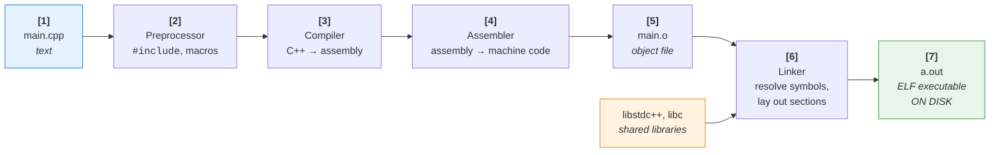

At this point **nothing is in memory**. `a.out` is just a file containing `.text`, `.rodata`,
`.data`, a description of how big `.bss` must be, and a list of the shared libraries it needs.

> Notice that `.bss` has no content in the file - only a size. That is why a program with a
> `static int big[1000000];` (4 MB of zeros) produces a tiny executable.
>
> Check it yourself: `size a.out` prints the size of `text`, `data` and `bss`.

### Step 2 - From executable file to a process (`exec()`)

When you type `./a.out`, the shell calls `fork()` + `execve()`. The kernel then:

1. Creates a fresh, **empty** virtual address space (a new set of page tables).
2. **Maps** the segments of the **ELF** (Executable and Linkable Format) file into that address space, it does *not* read them yet.
   This is `mmap()`: "virtual pages `0x401000..0x401fff` correspond to bytes `0x1000..0x1fff` of
   this file."
3. Sets up `.bss`, the heap and the stack as **anonymous** mappings (backed by no file, filled with
   zeros on first touch).
4. Hands control to the dynamic linker (`ld.so`), which maps the shared libraries the same way.
5. Jumps to the entry point, which eventually calls function `main()`.

The key idea: after `exec()`, the address space is mostly a **set of promises**. Barely any physical
RAM has been used yet. Pages are brought in only when the program actually touches them, this is
called **demand paging**.

### Step 3 - Virtual address → physical address

Every address your program ever sees `&arr[0]`, a function pointer, `this`  is a **virtual**
address. The CPU's **MMU** (Memory Management Unit) translates it to a physical address on every
single memory access, using the page tables of the currently running process.

Memory is handled in fixed-size blocks:

- a block of **virtual** memory is a **page** (4 KB on x86-64 by default)
- a block of **physical** memory is a **frame** (same size)

Because 4 KB = 2^12, a virtual address splits into two parts:

```text
 virtual address of arr[0] =  0x7ffd4a3b2c40

 ┌──────────────────────────────┬──────────────┐
 │   0x7ffd4a3b2                │     0xc40    │
 │   virtual page number (VPN)  │    offset    │
 │   → translated by the MMU    │  → unchanged │
 └──────────────────────────────┴──────────────┘

 page table says:   VPN 0x7ffd4a3b2  →  frame 0x1A2B3   (rw-, present)

 physical address = 0x1A2B3 * 0x1000 + 0xc40 = 0x1A2B3c40
```

Only the page number is translated; the offset inside the page is copied through unchanged. This is
why translation can be a simple table lookup instead of per-byte bookkeeping.

> On x86-64 the "page table" is really a 4-level tree (PML4 → PDPT → PD → PT). The `CR3` register
> holds the physical address of the top level for the current process, and a context switch is
> essentially "load a different `CR3`". To avoid walking 4 levels on every access, the CPU caches
> recent translations in the **TLB** (Translation Lookaside Buffer).

### Aside - why is it called a "page"?

The name is a **book metaphor**, and a surprisingly literal one.

A book is one continuous text, but it is physically divided into equal-sized pages. You never need
the whole book spread out in front of you: you keep a few pages open on the desk and the rest stays
on the shelf. An address space works the same way. It is one continuous range, cut into fixed-size
chunks, and only some of those chunks need to be in RAM at any moment. The rest stay on disk until
the program "turns to" them.

The metaphor extends to the second term. A **page** is the chunk of *virtual* memory - the content.
A **page frame** is the slot of *physical* memory that holds it - the container, like a picture
frame or an album sleeve. Any page can be slid into any frame, which is exactly what the diagram in
Step 4 shows: the same page may occupy different frames during its lifetime, and one frame may be
shared by pages belonging to several processes.

**Where the word comes from.** The **Atlas** computer at the University of Manchester (operational
1962) invented virtual memory. Kilburn, Edwards, Lanigan and Sumner's paper *"One-Level Storage
System"* described a small fast core store backed by a much larger magnetic drum, with hardware
automatically moving 512-word blocks between the two so that the programmer saw *one* level of
storage instead of two. Those blocks were called **pages**, the core-store slots were called **page
frames**, and a set of associative "page address registers" served as the first TLB. Almost every
term in this chapter is 1962 vocabulary that was simply never replaced.

**The reason the metaphor fits: every page is the same size.** This is the real engineering decision
behind paging, and it is worth dwelling on. The competing idea was **segmentation** - divide memory
into variable-sized, logically meaningful units ("the code segment", "this array"). That sounds more
natural, but it fragments badly: free memory degenerates into many gaps of the wrong size, and every
allocation becomes a best-fit search. Uniform pages make every free frame **interchangeable**, so
allocation is "take any frame off the free list" and *external fragmentation disappears entirely*.

The price is **internal fragmentation**: the last page of a region is only partly used, wasting on
average half a page. Book pages behave identically - a page is a full page whether it carries one
word or four hundred.

**Why 4 KB?** A trade-off that the Intel 80386 fixed in 1985 and x86 compatibility froze in place:

| | Smaller pages | Larger pages |
|---|---|---|
| Internal fragmentation | less waste | more waste |
| Page table size | more entries | fewer entries |
| TLB reach | covers less memory | covers more memory |
| Fault I/O | many small reads | fewer, larger reads |

Modern hardware hedges by offering **huge pages** as well (2 MB and 1 GB on x86-64). ARM64 supports
4 KB, 16 KB and 64 KB base pages - Apple Silicon uses 16 KB.

**The page is the unit of five different things at once**, which is why the concept is so central:

| Page is the unit of... | Consequence |
|---|---|
| mapping | one page-table entry per page, not per byte |
| protection | `r`/`w`/`x` are per page - you cannot make half a page read-only |
| residency | a page is either present in RAM or it is not |
| transfer | the kernel reads and writes whole pages to and from disk |
| accounting | RSS, page-fault counts and `/proc/<pid>/smaps` all count pages |

The second row is the one that explains the `arr[7]` bug in chapter 2.1: the hardware protects
*pages*, not objects. It has no idea your array exists.

> **Paging vs swapping.** These are often used interchangeably, but historically *swapping* meant
> evicting an **entire process** to disk, while *paging* moves **individual pages**. Linux's "swap
> space" is a leftover misnomer: it holds paged-out anonymous pages, not whole processes.

### Step 3.5 - Who actually allocates the memory?

It is tempting to say "the CPU asks the kernel for memory". That phrasing hides the mechanism, so it
is worth being precise.

**The kernel is not a separate thing the CPU talks to. The kernel is code running on that same CPU.**
There is one processor executing instructions. What changes is *which* code is executing and at
*what privilege level* - ring 3 (user mode) for your program, ring 0 (kernel mode) for the kernel.
So nothing ever "asks the CPU" for memory. Instead, the CPU stops executing your process's
instructions and starts executing kernel instructions, with more privilege.

There are exactly two doors into the kernel, and confusing them is the most common mistake:

| | **System call** | **Page fault** |
|---|---|---|
| Who triggers it | your code, deliberately (the `syscall` instruction) | the MMU, in the middle of an instruction |
| Voluntary? | yes - it is a request | no - it is an exception |
| Examples | `mmap`, `brk`, `write`, `read` | touching a page that is not present |
| When the kernel returns | the *next* instruction runs | the **same** instruction runs again |

Step 5 below is the second column drawn out in detail. Note the direction of travel: the hardware
notifies the software, not the other way round.

**`malloc()` usually does not reach the kernel at all.**

This surprises almost everyone. `malloc` is an ordinary **user-space function** in the C library. It
keeps a pool (an *arena*) of memory it obtained earlier, and most calls simply hand you a chunk from
its free list - no system call, no privilege switch, tens of nanoseconds. Only when that pool is
exhausted does it call into the kernel: `brk` to extend the heap, or `mmap` for large requests
(128 KB and above, by default, in glibc).

And even *that* does not allocate physical memory. `mmap` only records a **VMA** - a note saying
"this range of virtual addresses is now legal". Not one physical frame is assigned. The frame
appears only when you first touch the page, via a fault.

So there are three layers of laziness stacked on top of each other:

```text
   new / malloc()      →  usually pure user space, the kernel is never entered
        ↓  (only when the arena is empty)
   brk / mmap syscall  →  kernel bookkeeping only: "this range is legal now"
        ↓  (only on the first touch of each page)
   page fault          →  the kernel finally allocates a physical frame
```

**The full path of `int* p = new int[1000]; p[0] = 1;`**

1. `new` calls `operator new`, which calls `malloc` - user space. It normally returns a pointer
   straight from the arena. The kernel is not involved at all.
2. *Only if the arena is too small:* `syscall` → ring 0 → the kernel creates or extends a VMA →
   returns to ring 3. Still **zero** physical memory committed.
3. `p[0] = 1` issues a store. The MMU translates the address, misses in the TLB, walks the page
   tables **in hardware**, and finds the entry marked not present.
4. The MMU raises a **page fault** exception. The CPU switches to ring 0 and jumps to the kernel's
   fault handler.
5. The kernel checks the address against the process's VMAs. It is valid, so the kernel takes a free
   physical frame, zeroes it, and installs the page-table entry.
6. The kernel returns, and the CPU **re-executes the same store instruction**, which now succeeds.

Two consequences worth stressing:

- **A successful translation involves the kernel zero percent.** The page-table walk is done by
  hardware. If the kernel were consulted on every memory access, nothing would ever run. It is
  entered only on a fault. (On x86-64 even the TLB-miss walk is hardware. Some architectures, such
  as MIPS, hand TLB misses to software instead - so this is a design choice, not a law of nature.)
- **A stack array involves nobody.** `int arr[5];` compiles to `sub rsp, 24` - no `malloc`, no
  system call, no kernel. The only possible kernel involvement is a fault the first time a new stack
  page is touched.

> **See it for yourself.** The numbers are counter-intuitive, which makes this a good demonstration:
>
> ```bash
> strace -c -e trace=brk,mmap ./a.out    # a million mallocs → a handful of syscalls
> /usr/bin/time -v ./a.out               # minor page faults ≈ pages actually touched
> ```

### Aside - the kernel in Linux, Windows and Unix

Everything above is described in Linux terms, but nothing about it is specific to Linux. Every
general-purpose operating system needs the same machinery, because the same hardware imposes it: a
page-table format defined by the CPU, a fault handler, a physical frame allocator, and a way to
describe which address ranges are legal.

**First, the names.** "Operating system" and "kernel" are not the same thing, and most of the famous
names below are kernels:

| Kernel | Written by | Since | Where it runs |
|---|---|---|---|
| **Unix** | Ken Thompson and Dennis Ritchie, Bell Labs | 1969 | the ancestor of almost every row below |
| **Linux** | Linus Torvalds, then a student in Helsinki | 1991 | Android, most servers, every machine on the TOP500 supercomputer list |
| **Windows NT** (`ntoskrnl.exe`) | a Microsoft team led by Dave Cutler, previously the architect of DEC's VMS | 1993 | every Windows since NT 3.1, and the Xbox |
| **XNU** | NeXT, bolting CMU's **Mach** microkernel to a BSD layer; inherited by Apple | 1989 | macOS, iOS, watchOS |
| **FreeBSD** | the Berkeley CSRG lineage | 1993 | Netflix's CDN, the PlayStation |
| **MINIX 3** | Andrew S. Tanenbaum, Vrije Universiteit Amsterdam | 1987 | teaching - and, famously, inside Intel's Management Engine |
| **QNX** | Gordon Bell and Dan Dodge, Waterloo | 1982 | cars, medical devices, industrial control |
| **seL4** | NICTA / Data61, Australia | 2009 | avionics and security research; the first kernel with a machine-checked proof of correctness |

> **"Linux" is the kernel, not the operating system.** What you install is a *distribution*: the
> Linux kernel plus the GNU userland, a libc, a shell, a package manager and a desktop - which is
> why the pedantic name **GNU/Linux** exists. Android ships the same kernel with almost none of the
> GNU parts.

What differs between them is the **kernel architecture** - how much code runs in ring 0:

| Design | Idea | Examples |
|---|---|---|
| **Monolithic** | the whole kernel (scheduler, memory, filesystems, drivers) runs in kernel mode, one address space | Linux, FreeBSD, classic Unix |
| **Microkernel** | only the bare minimum in kernel mode; drivers and filesystems are user-space servers | MINIX 3, QNX, seL4 |
| **Hybrid** | a microkernel-influenced structure, but most of it still runs in kernel mode for speed | Windows NT, macOS (XNU) |

Linux is monolithic but **modular**: drivers load and unload at runtime as kernel modules, which
gives some of the flexibility of a microkernel without the cost of crossing a protection boundary
for every operation.

> **The argument that produced that table.** In January 1992 Tanenbaum opened a `comp.os.minix`
> thread titled *"LINUX is obsolete"*, arguing that monolithic kernels were a step backwards and
> that microkernels were the future; Torvalds replied in kind, and the exchange is still worth
> reading. Both sides aged well: microkernels won where correctness matters most - QNX in cars,
> seL4 in avionics - monolithic kernels won wherever raw throughput matters, and Linux quietly
> absorbed the modularity half of the argument.

**The concepts are universal; only the names change.** This table is worth keeping next to you the
first time you read a Windows or macOS memory article:

| Concept | Linux | Windows (NT) | macOS (XNU) |
|---|---|---|---|
| Kernel design | monolithic + modules | hybrid, NT executive | hybrid, Mach + BSD |
| Executable format | **ELF** | **PE/COFF** | **Mach-O** |
| Read-only data section | `.rodata` | `.rdata` | `__TEXT,__const` |
| "This range is legal" record | VMA (`vm_area_struct`) | VAD (Virtual Address Descriptor) | `vm_map_entry` |
| Per-physical-frame record | `struct page` | PFN database entry | `vm_page` |
| Grow the heap | `brk`, `mmap` | `VirtualAlloc` | `vm_allocate`, `mmap` |
| Map a file | `mmap` | section object, `MapViewOfFile` | `mmap` |
| Page-fault handler | `do_page_fault` | `MmAccessFault` | `vm_fault` |
| Backing store | swap partition or file | `pagefile.sys` | compressed memory + swapfile |
| Inspect a process | `/proc/<pid>/maps` | VMMap (Sysinternals) | `vmmap` |
| Inspect a binary | `readelf`, `objdump` | `dumpbin` | `otool` |

A few differences that actually matter in practice:

- **Linux guarantees a stable system-call interface**; a binary that issues raw `syscall`
  instructions keeps working across kernel versions. **Windows does not** - system call numbers
  change between releases, so programs must go through `ntdll.dll` and the Win32 API. This is why
  statically linking "the whole program" is normal on Linux and essentially impossible on Windows.
- **macOS is a certified UNIX**; Linux is *Unix-like* but has never been certified. XNU's name is a
  joke about exactly this: "X is Not Unix".
- **Page size is not universal either.** 4 KB on x86-64 for all three systems, but macOS on Apple
  Silicon uses **16 KB** pages - so the arithmetic in Step 3 changes on an M-series Mac: the offset
  is the low 14 bits, not the low 12.

Classic **Unix** is where the vocabulary came from: `fork`, `exec`, `brk`, the a.out format that ELF
replaced, and the idea that a process is an address space plus a thread of control. Linux, the BSDs
and macOS all inherit that model; Windows NT was designed independently (by a team from DEC VMS) and
arrives at the same hardware-imposed structure through different names.

### Step 4 - The whole picture: CPU, RAM and disk

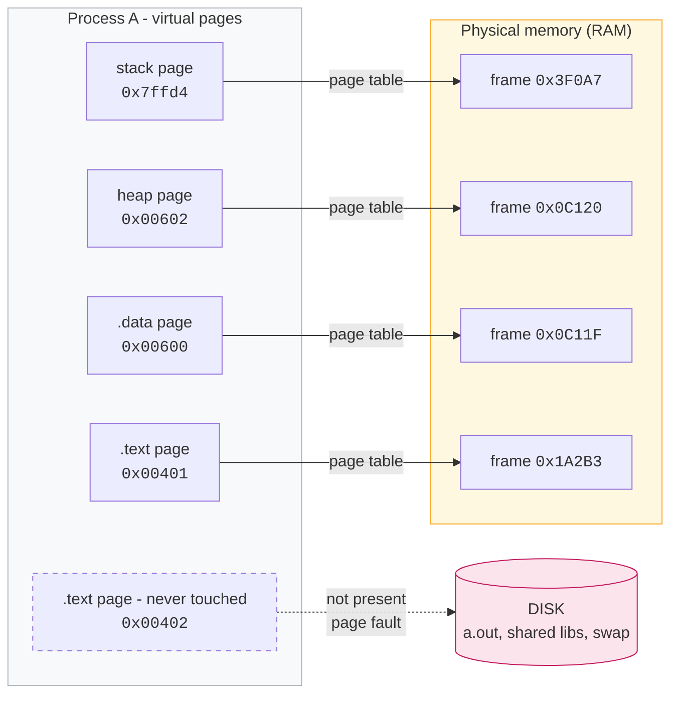

Three lessons from this picture, all of them worth stressing to students:

1. **Contiguous in virtual memory ≠ contiguous in physical memory.** Your array *looks* like one
   unbroken block, and for your code it behaves like one. Underneath, a 16 KB array can sit in four
   physical frames scattered anywhere in RAM.
2. **Not everything in the address space is in RAM.** A page can be absent because it has never been
   touched, or because the kernel evicted it to make room.
3. **Physical frames can be shared.** If you run `./a.out` twice, both processes map *the same*
   physical frames holding the read-only `.text`, the code is loaded into RAM once.

### Step 5 - What happens on a page fault

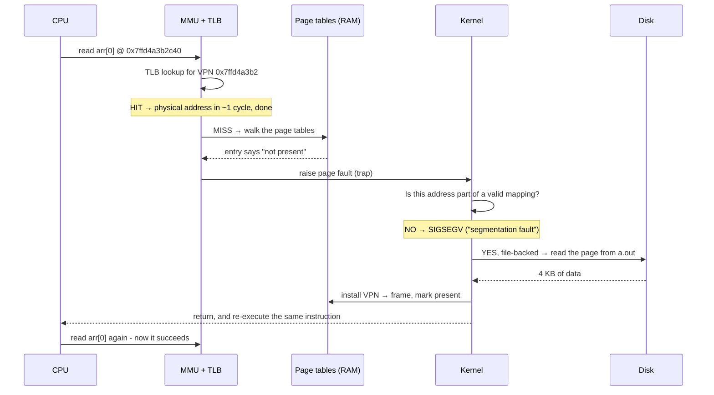

Two kinds of faults, and the difference is enormous in practice:

| | What the kernel must do | Rough cost |
|---|---|---|
| **Minor fault** | Just fix up the page table: hand out a zeroed page (first touch of `.bss`, heap or stack), or a page already sitting in the page cache | microseconds |
| **Major fault** | Actually read from disk (the executable, a shared library, or swap) | ~100 µs on SSD, ~10 ms on HDD |

> `/usr/bin/time -v ./a.out` reports both counts as "minor/major page faults". A program that runs
> slowly with a high major-fault count is *thrashing* - it is using more memory than fits in RAM.

So the disk plays two distinct roles:

- **file-backed pages**:  the code and constants of your program and its libraries. They can always
  be dropped and re-read from the file, so they never need swap.
- **anonymous pages**: your stack, heap and `.bss`. They exist only in RAM, so if the kernel needs
  to evict them it must write them to **swap** first.

### Walk-through - allocate, touch, free, dangle

Everything in this chapter comes together in one short program. Follow it frame by frame and watch
three things move independently: the **pages** of the address space, the **page table**, and the
**physical frames**. Almost every misconception about memory comes from assuming those three change
at the same time. They do not.

```c++
int* p = new int[4096];              // 16 KB = 4 pages
p[0] = 1;
p[1024] = 2;
for (int i = 0; i < 4096; ++i) p[i] = i;
delete[] p;
p[0] = 99;                           // undefined behaviour
```

**Step 1 - nothing exists yet**

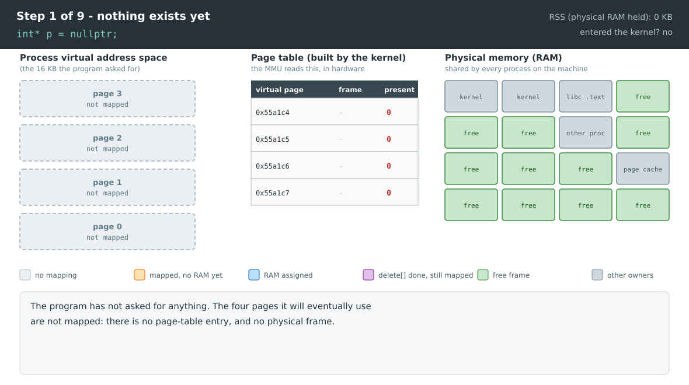

**Step 2 - `new[]` asks the kernel, and the kernel commits nothing**

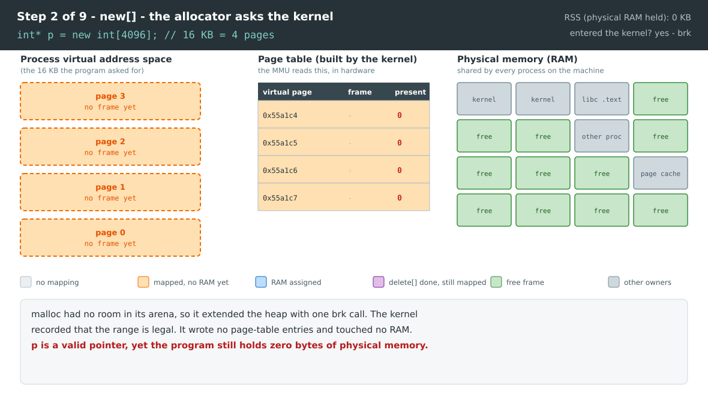

**Step 3 - the first write, and the MMU objects**

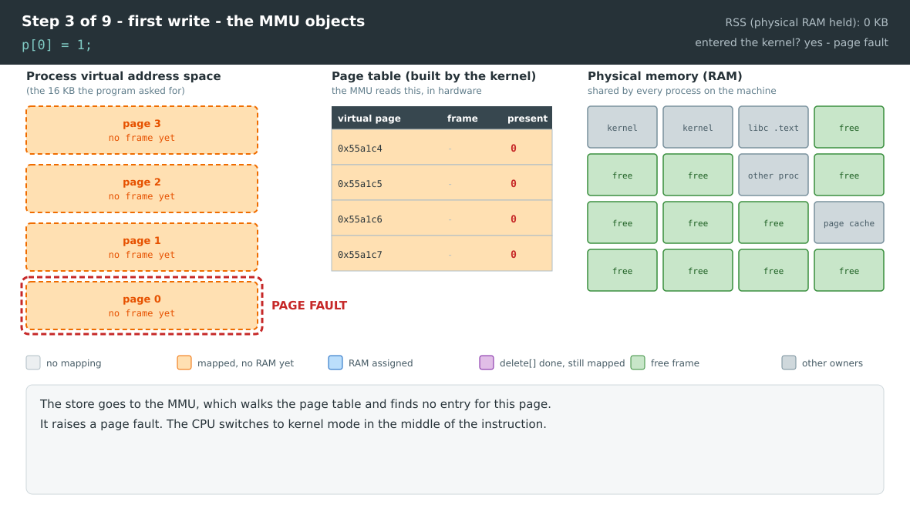

**Step 4 - the kernel resolves the fault and the instruction re-runs**

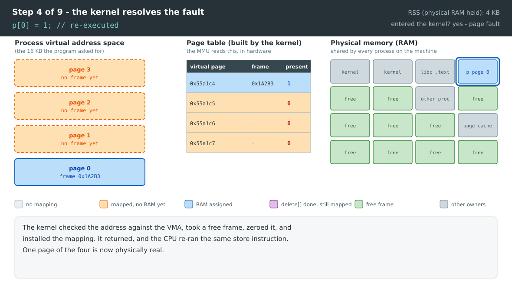

**Step 5 - a second page, a second fault**

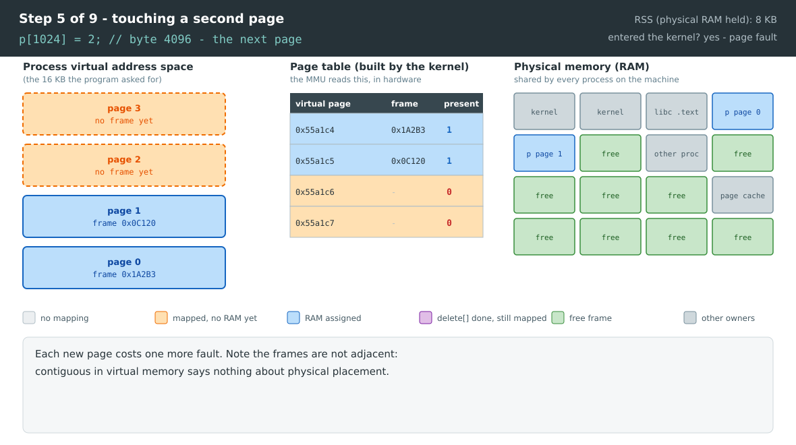

**Step 6 - fully resident, at last**

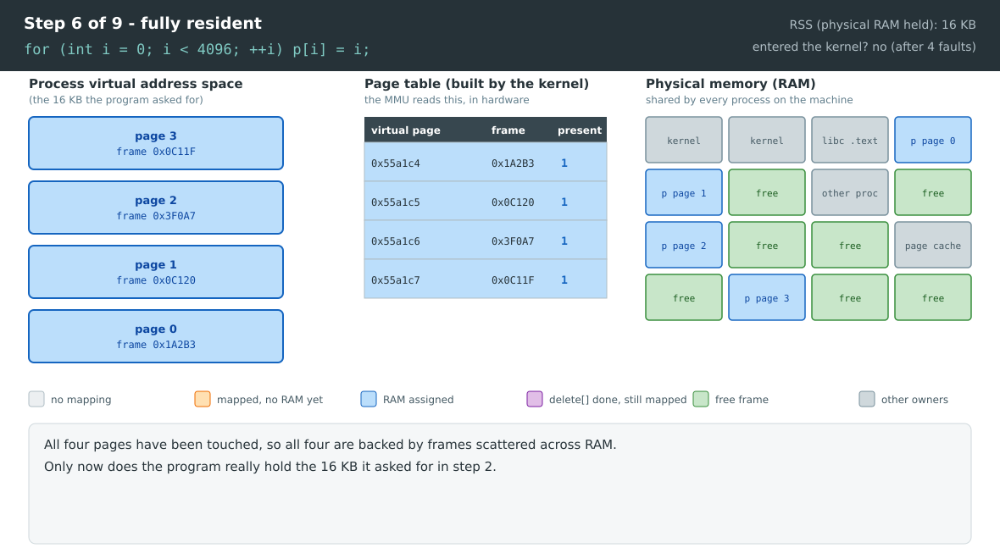

**Step 7 - `delete[]`, and almost nothing happens**

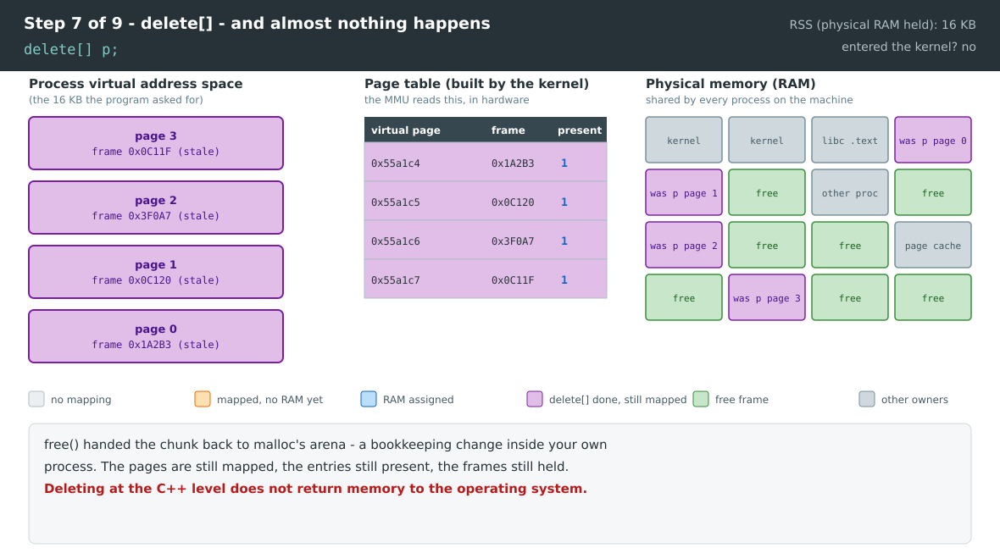

**Step 8 - use-after-free, and why it does not crash**

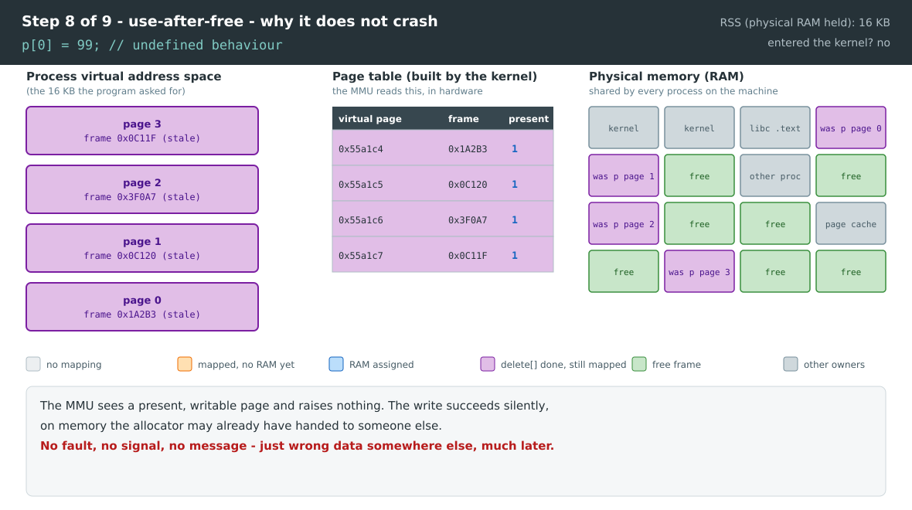

**Step 9 - the memory finally goes back**

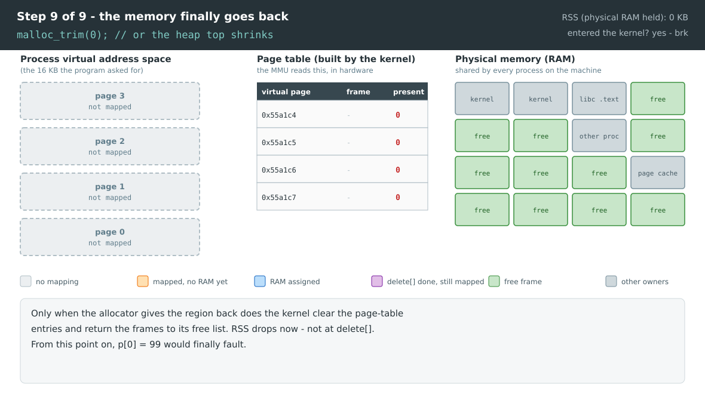

**What the nine frames are really showing**

| Frame | The lesson |
|---|---|
| 2 | A valid pointer can exist with **zero** bytes of physical memory behind it. `new` reserves addresses, not RAM. |
| 3 → 4 | A page fault is not an error. It is the normal way memory gets allocated, and the faulting instruction is re-executed afterwards. |
| 5 → 6 | Virtually contiguous is not physically contiguous. Four consecutive pages, four unrelated frames. |
| 7 | `delete[]` returns memory to **your allocator**, not to the operating system. RSS does not move. |
| 8 | Use-after-free does not crash *because* of frame 7: the page is still mapped and writable, so the hardware has no objection. |
| 9 | Only `munmap` actually gives memory back. This is why a long-running process can hold memory it is no longer using. |

**One honest caveat: the size decides the story.** Frames 7 to 9 are true for allocations served
from malloc's arena. glibc switches to `mmap` for large requests (128 KB and above by default), and
`free()` unmaps *those* immediately. Measured on a real machine with `/proc/self/status`:

| | `VmSize` (address space) | `VmRSS` (real memory) |
|---|---|---|
| **16 KB - served from the arena (`brk`)** | | |
| after `new[]` | unchanged | unchanged |
| after touching every element | unchanged | +16 KB |
| after `delete[]` | unchanged | **unchanged - still held** |
| **16 MB - served by `mmap`** | | |
| after `new[]` | **+16 MB** | +4 KB |
| after touching every element | +16 MB | **+16 MB** |
| after `delete[]` | **back to start** | **back to start** |

Both halves of that table are worth staring at. The large case is frame 2 in its purest form -
16 MB of address space appears while physical memory does not move at all. The small case is
frame 7: the memory never goes back to the kernel, which is why a long-running process can look
like it is leaking when it is merely reusing its own arena.

> **Watch it happen on your own machine.** Put a `getchar()` between the steps and read
> `/proc/<pid>/status` at each pause:
>
> ```bash
> grep -E 'VmSize|VmRSS' /proc/$(pgrep demo)/status
> ```
>
> `VmSize` (the address space) jumps at step 2. `VmRSS` (real memory) only climbs as you touch
> pages, and does **not** fall at `delete[]`. That single observation is the whole section.

---

## Where to go next

Back to **[2.1 Arrays, Structures & Pointers](2.1%20array_structure_pointers_in_cplusplus_for_dsa.md)**,
where these mechanisms show up as ordinary C++ rules:

| You saw here | It explains |
|---|---|
| Protection is per page, not per object | why `arr[7]` does not crash (2.1 section 1.2) |
| The lowest page is deliberately unmapped | why `*nullptr` always does (2.1 section 3.1) |
| Pages are filled on first touch | why `new` is cheap and the first write is not (2.1 section 3.5) |
| `free()` returns memory to the allocator, not the OS | why use-after-free is silent (2.1 section 3.5) |
| RAM arrives in 64-byte cache lines | why array traversal beats pointer chasing (2.1 sections 2.6, 3.9) |
